# HTML+CSS

##HTML第一天

###我们接下来是进行的网页开发网页的相关概念:

+  什么是网页?
+  什么是HTML?
+  网页的形成?

##什么是网页：

> 1.<font color='red'> 网站 </font>是指在因特网上根据一定的规则，使用 HTML 等制作的用于展示特定内容相关的网页集合。
>
> 2.网页是网站中的一“页”，<font color='red'>通常是 HTML 格式的文件</font>，它要通过浏览器来阅读。

###网页的组成：

> 1.<font color='red'>网页是构成网站的基本元素，</font>它通常由图片、链接、文字、声音、视频等元素组成。通常我们看到的网页，常见以 .htm 或 .html 后缀结尾的文件，因此将其俗称为 HTML 文件。


###什么是HTML：

> 1. <font color='orange'>HTML 指的是超文本标记语言 (Hyper Text Markup Language)</font> ，它是用来描述网页的一种语言。
> 2. HTML 不是一种编程语言，而是一种标记语言 (markup language)。
> 3. <font color='green'>标记语言是一套标记标签 (markup tag)。</font>

#### 超文本

> 超文本，有 2 层含义：
> 1. 它可以加入图片、声音、动画、多媒体等内容（<font color='red'>超越了文本限制 </font>）。
> 2. 它还可以从一个文件跳转到另一个文件，与世界各地主机的文件连接（<font color='red'>超级链接文本 </font>）。

###网页的总结：

> 1. <font color='red'>网页是图片、链接、文字、声音、视频等元素组成, 其实就是一个html文件(后缀名为html)</font>
> 2. 网页生成制作:  有前端人员书写 HTML 文件, 然后浏览器打开,就能看到了网页.
> 3. HTML: 超文本标记语言, 用来制作网页的一门语言. 有标签组成的. 比如 图片标签 链接标签 视频标签等…

###浏览器：

**常用的浏览器**

+  IE
+  火狐
+  谷歌
+  苹果
+  欧朋

-  浏览器是网页显示、运行的平台。常用的浏览器有 IE、火狐（Firefox）、谷歌（Chrome）、Safari和Opera等。平时称为五大浏览器。
-  查看浏览器市场份额：http://tongji.baidu.com/data/browser
   
   **浏览器内核（渲染引擎）**

+  **<font color='red'>负责读取网页内容，整理讯息，计算网页的显示方式并显示页面</font>**
   
+  目前国内一般浏览器都会采用 Webkit/Blink 内核，如 360、UC、QQ、搜狗等。

##web标准(important)

+  **<font color='blue'>Web 标准是由 W3C 组织和其他标准化组织制定的一系列标准的集合。W3C（万维网联盟）是国际最著名的标准化组织。</font>**

###为什么需要Web标准：

+ 浏览器不同，它们显示页面或者排版就有些许差异
  

+ **遵循 Web 标准除了可以让不同的开发人员写出的页面更标准、更统一外**，还有以下优点：

  > 1. 让 Web 的发展前景更广阔。 
  > 2. 内容能被更广泛的设备访问。
  > 3. 更容易被搜寻引擎搜索。
  > 4. 降低网站流量费用。
  > 5. 使网站更易于维护。
  > 6. 提高页面浏览速度。

##web标准的构成：

主要包括<font color='red'>结构（Structure） 、表现（Presentation）和行为（Behavior）</font>三个方面。

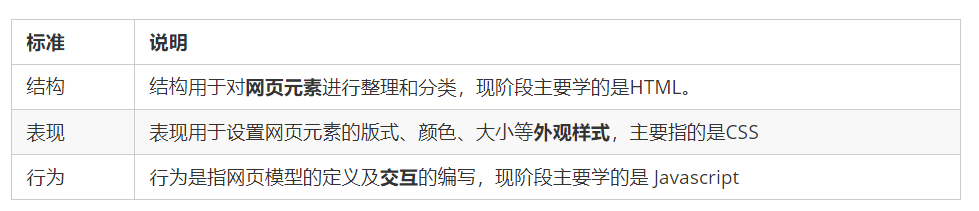
Web 标准提出的最佳体验方案：**结构、样式、行为相分离**。  
简单理解：**<font color='green'>结构写到 HTML 文件中， 表现写到 CSS 文件中， 行为写到 JavaScript 文件中</font>**


1.结构类似身体

2.表现类似外观装饰

3.行为类似行为动作

4.相比较而言, 三者中结构最重要.

  

**介绍一下你对浏览器内核的理解？常见的浏览器内核有哪些？**

浏览器内核包括两部分，渲染引擎和js引擎。渲染引擎负责读取网页内容，整理讯息，计算网页的显示方式并显示页面，js引擎是解析执行js获取网页的动态效果。 后来 JS 引擎越来越独立，内核就倾向于只指渲染引擎。

> IE：Trident
>
> firefox：Gecko
>
> chrome、safari：webkit
>
> Opera：Presto
>
> Microsoft Edge：EdgeHTML

# HTML标签的导读

###HTML语法规则：

> 1. HTML 标签是由<font color='red'>尖括号包围的关键词</font>，例如 <html>。
>
> 2. HTML 标签通常是成对出现的，例如 <html> 和 </html> ，我们称为**双标签**。标签对中的第一个标签是开始标签，第二个标签是结束标签。 
>
> 3. 有些特殊的标签必须是单个标签（极少情况），例如 <br />，我们称为**单标签**。  

###标签的关系：

> 双标签关系可以分为两类：包含关系和并列关系
>
> 1. 包含关系：
>
>     <head>  
>         <title> </title> 
>     </head>

 

> 2. 并列关系：
>
> ​      <head> </head>
>
> ​         <body> </body>

 

###基本结构标签：

每个网页都会有一个<font color='red'>基本的结构标签（也称为骨架标签）</font>，页面内容也是在这些基本标签上书写。

**HTML页面也称为 HTML 文档.**


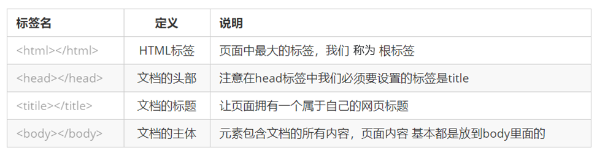 

HTML 文档的的后缀名必须是 .html 或 .htm ，浏览器的作用是读取 HTML 文档，并以网页的形式显示出它们。
此时，用浏览器打开这个网页，我们就可以预览我们写的第一个 HTML 文件了

**基本结构标签总结：**


###开发工具：

     
**VSCode的使用：**

    1. 双击打开软件。
    2. 新建文件（Ctrl + N ）。
    3. 保存（Ctrl + S ）, 注意移动要保存为 .html 文件
    4. Ctrl + 加号键 ，Ctrl + 减号键  可以放大缩小视图 
    5. 生成页面骨架结构。 输入! 按下 Tab 键。
       6. 利用插件在浏览器中预览页面：单击鼠标右键，在弹出窗口中点击“Open In Default Browser”。

1. DOCTYPE
2. lang 语言
3. charset 字符集

#### DOCTYPE


#### lang语言

> 用来定义当前文档显示的语言。
> 1. en定义语言为英语
>
> 2. zh-CN定义语言为中文
>
>   简单来说：<font color='red'>定义为en 就是英文网页, 定义为 zh-CN 就是中文网页</font>
>   其实对于文档显示来说，定义成en的文档也可以显示中文，定义成zh-CN的文档也可以显示英文
>   这个属性对浏览器和搜索引擎(百度.谷歌等)还是有作用的

#### charset字符集

字符集 (Character set)是多个字符的集合。以便计算机能够识别和存储各种文字。

在<head>标签内，可以通过<meta> 标签的 <font color='red'>charset 属性来规定 HTML 文档应该使用哪种字符编码。</font>


**总结：**

> 1. 以上三个代码 vscode 自动生成,基本不需要我们重写.
> 2. <!DOCTYPE html> 文档类型声明标签,告诉浏览器这个页面采取html5版本来显示页面.
> 3. <html lang=“en”> 告诉浏览器或者搜索引擎这是一个英文网站. 本页面采取英文来显示.
> 4. <meta charset=“ UTF-8” /> 必须写. 采取 UTF-8来保存文字.

## HTML常用标签

###语义化标签：

学习标签是有技巧的，重点是记住每个标签的语义。<font color='red'>简单理解就是指标签的含义，即这个标签是用来干嘛的。</font>

###什么是语义化标签：

<font color='green'>根据标签的语义，在合适的地方给一个最为合理的标签，可以让页面结构更清晰。</font>

下图没有语义化标签：


###添加语义标签：


##常用的标签：

###标题标签

> 为了使网页更具有语义化，我们经常会在页面中用到标题标签。HTML 提供了 6 个等级的网页标题，
> 即<h1> - <h6> 。


单词 head 的缩写，意为头部、标题。

<font color='blue'>标签语义：作为标题使用，并且依据重要性递减。</font>

> 特点：
>
> 1. <font color='red'>加了标题的文字会变的加粗，字号也会依次变大。</font>
> 2. **一个标题独占一行。**


###段落标签：

在网页中，要把文字有条理地显示出来，就需要将这些文字分段显示。在 HTML 标签中，<p>标签**用于定义段**
**落，它可以将整个网页分为若干个段落。**


<font color='blue'>标签语义：可以把 HTML 文档分割为若干段落。</font>

> 特点：
> 1. **文本在一个段落中会根据浏览器窗口的大小自动换行。**
> 2. 段落和段落之间保有空隙。

###换行标签

在 HTML 中，一个段落中的文字会从左到右依次排列，直到浏览器窗口的右端，然后才自动换行。如果希望
**某段文本强制换行显示，就需要使用换行标签** <br />


<font color='blue'>标签语义：强制换行。</font>

> 特点：
> 1. <br /> 是个单标签。
> 2. <br /> 标签只是简单地开始新的一行，跟段落不一样，段落之间会插入一些垂直的间距。

###文本格式化标签：

在网页中，**有时需要为文字设置粗体、斜体 或下划线等效果，这时就需要用到 HTML 中的文本格式化标签，使文字以特殊的方式显示。**

**<font color='blue'>标签语义: 突出重要性, 比普通文字更重要.</font>**


###div和span标签

    <div> 和 <span> 是没有语义的，它们就是一个盒子，用来装内容的。
    具体实现：
         <div> 这是头部 </div>    
         <span> 今日价格 </span>


###图片标签：

在 HTML 标签中， 标签用于定义 HTML 页面中的图像。


> src 是标签的必须属性，它<font color='red'>用于指定图像文件的路径和文件名。</font>
>
> **所谓属性：简单理解就是属于这个图像标签的特性。**

 
    图像标签注意点：

1. <font color='red'>图像标签可以拥有多个属性，必须写在标签名的后面。</font>
2. 属性之间不分先后顺序，标签名与属性、属性与属性之间均以空格分开。
3. **属性采取键值对的格式，即 key=“value" 的格式，属性 =“属性值”。**

###路径：


页面中的图片会非常多， 通常我们会新建一个文件夹来存放这些图像文件（images），这时再查找图像，就需
要采用“路径”的方式来指定图像文件的位置。

> 路径可以分为：
> 1. 相对路径
> 2. 绝对路径

**1、相对路径**

<font color='green'>相对路径：以引用文件所在位置为参考基础，而建立出的目录路径。</font>

这里简单来说，图片相对于 HTML 页面的位置

 
 特点：

- 相对路径是从代码所在的这个文件出发，去寻找目标文件的，而我们这里所说的上一级 、下一级和同一级就是 图片相对于 HTML 页面的位置。


**2、绝对路径：**

<font color='blue'>绝对路径：是指目录下的绝对位置，直接到达目标位置，通常是从盘符开始的路径。</font>

例如，“D:\web\img\logo.gif”或完整的网络地址“http://www.itcast.cn/images/logo.gif”

###超链接标签：

> 在 HTML 标签中，<a> 标签用于定义超链接，**<font color='red'>作用是从一个页面链接到另一个页面。</font>**
> 1. 链接的语法格式
> 2. 链接的分类


**属性：**


链接分类：

1. 外部链接：例如 < a href="http:// www.baidu.com "> 百度</a >。
2. 内部链接：网站内部页面之间的相互链接. 直接链接内部页面名称即可，例如 < a href="index.html"> 首页 </a >。
3. 空链接：如果当时没有确定链接目标时，< a href="#"> 首页 </a > 。
4. 下载链接：如果 href 里面地址是一个文件或者压缩包，会下载这个文件。
5. 网页元素链接：在网页中的各种网页元素，如文本、图像、表格、音频、视频等都可以添加超链接.
6. **锚点链接:  点我们点击链接,可以<font color='red'>快速定位</font>到页面中的某个位置.** 

+        在链接文本的 href 属性中，设置属性值为 <font color='red'>#名字</font> 的形式，如<a href="#two"> 第2集 </a> 
+        找到目标位置标签，里面添加一个 id 属性 = 刚才的名字 ，如：<h3 id="two">第2集介绍</h3>

###注释

**如果需要在 HTML 文档中添加一些便于阅读和理解但又不需要显示在页面中的注释文字，就需要使用注释标签。**

> HTML中的注释以“<!--”开头，以“ -->”结束。


###特殊字符：

在 HTML 页面中，一些特殊的符号很难或者不方便直接使用，此时我们就可以使用下面的字符来替代。

 
    重点记住：**空格 、大于号、 小于号 这三个**， 其余的使用很少，如果需要回头查阅即可。


#表格

###表格的主要作用

> 1. 表格主要用于显示、展示数据，因为它可以让数据显示的非常的规整，可读性非常好。特别是后台展示数据的时候，能够熟练运用表格就显得很重要。一个清爽简约的表格能够把繁杂的数据表现得很有条理
>
> 2. **表格不是用来布局页面的,而是用来展示数据的。**

​    

#### 表格的具体语法：


        1. <table> </table> 是用于定义表格的标签。
                2.<tr> </tr> 标签用于<font color='red'>定义表格中的行</font>，必须嵌套在 <table> </table>标签中。
                3.<td> </td> 用于<font color='green'>定义表格中的单元格</font>，必须嵌套在<tr></tr>标签中。
                4.字母 td 指表格数据（table data），即数据单元格的内容。

###表头单元格标签：

一般**<font color='blue'>表头单元格位于表格的第一行或第一列，表头单元格里面的文本内容加粗居中显示.</font>**

<th> 标签表示 HTML 表格的表头部分(table head 的缩写)


###表格属性：

表格标签这部分属性我们实际开发我们不常用，后面通过 CSS 来设置.

​        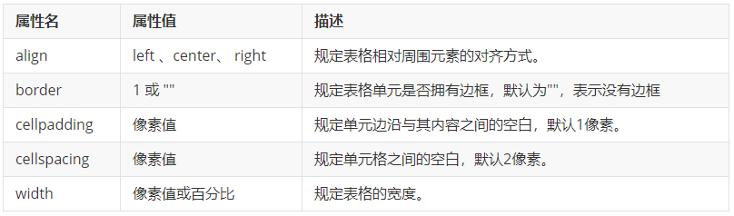
​    完成下面综合案例：

​    

**思路：**

**先制作表格的结构.**  

1.第一行里面是 th 表头单元格

2.第二行开始里面是 td 普通单元格单元格里面可以放任何元素

3.文字链接图片等都可以

**后书写表格属性**

1.用到宽度高度边框cellpadding 和 cellspacing

2.表格浏览器中对齐 align   

###表格结构标签：

> 使用场景:
>
> - 因为表格可能很长,为了更好的表示表格的语义，可以将表格分割成 表格头部和表格主体两大部分.
>
> 在表格标签中，分别用：<thead>标签：表格的头部区域、<tbody>标签：表格的主体区域. 这样可以更好的分清表格结构。


**总结:**
    1. <thead></thead>：用于定义表格的头部。<thead> 内部必须拥有 <tr> 标签。 一般是位于第一行。
    2. <tbody></tbody>：用于定义表格的主体，主要用于放数据本体 。
    3.  以上标签都是放在 <table></table> 标签中。

###合并单元格：

> 特殊情况下,可以把多个单元格合并为一个单元格,  这里同学们会最简单的合并单元格即可.
>
> 1. 合并单元格方式
> 2. 目标单元格
> 3. 合并单元格的步骤
>
> 如下图：


**合并单元格方式：**

**跨行合并**：<font color='red'>rowspan="合并单元格的个数"    </font> 

​	最上侧单元格为目标单元格, 写合并代码

 **跨列合并**：<font color='red'>colspan="合并单元格的个数"</font>

​	最左侧单元格为目标单元格, 写合并代码


**合并单元格三步曲：**

1. 先确定是跨行还是跨列合并。

2. 找到目标单元格. 写上合并方式 = 合并的单元格数量。比如：<td colspan="2"></td>。

3. 删除多余的单元格。

**表格总结**

​	表格学习整体可以分为三大部分:

> **表格的相关标签**
>
> ​	table   thead  body  tr  th  td 
>
> **表格的相关属性**
>
> ​	cellspacing    cellpadding     width  height  border 
>
> **合并单元格**
>
> ​	  rowspan   collspan

##列表

> 1. **表格是用来显示数据的**，那么**列表就是用来布局的。** 
> 2. 列表最大的特点就是整齐、整洁、有序，它作为布局会更加自由和方便。
> 3. 根据使用情景不同，列表可以分为三大类：<font color='red'>无序列表、有序列表和自定义列表。</font>


###无序列表：

​	

`<ul>` 标签表示 HTML 页面中项目的无序列表，一般会以项目符号呈现列表项，而列表项使用 <li> 标签定义。无序列表的基本语法格式如下：


###有序列表：

​	

**有序列表即为有排列顺序的列表，**其各个列表项会按照一定的顺序排列定义。

在 HTML 标签中，**<ol> 标签用于定义有序列表，列表排序以数字来显示，并且使用 <li> 标签来定义列表项。**

有序列表的基本语法格式如下：


###自定义列表：


自定义列表的使用场景：<font color='red'>自定义列表常用于对术语或名词进行解释和描述，定义列表的列表项前没有任何项目符号。</font>


**在 HTML 标签中，<dl> 标签用于定义描述列表（或定义列表），该标签会与 <dt>（定义项目/名字）和 <dd>（描述每一个项目/名字）一起使用。**

语法如下：


###列表总结


##表单

现实中的表单：


**网页中的表单：**


###为什么需要表单：

> 使用表单目的是为了<font color='red'>收集用户信息。</font>
>
> 在我们网页中， 我们也需要跟用户进行交互，收集用户资料，此时就需要表单。

###表单的组成：

在 HTML 中，**<font color='blue'>一个完整的表单通常由表单域、表单控件（也称为表单元素）和 提示信息3个部分构成。</font>**


###表单域：

> - <font color='green'>表单域是一个包含表单元素的区域。</font>
> - 在 HTML 标签中， <form> 标签用于定义表单域，<font color='orange'>以实现用户信息的收集和传递。</font>
> -  注意：<form> 会把它范围内的表单元素信息提交给服务器.


###表单域的常用属性：

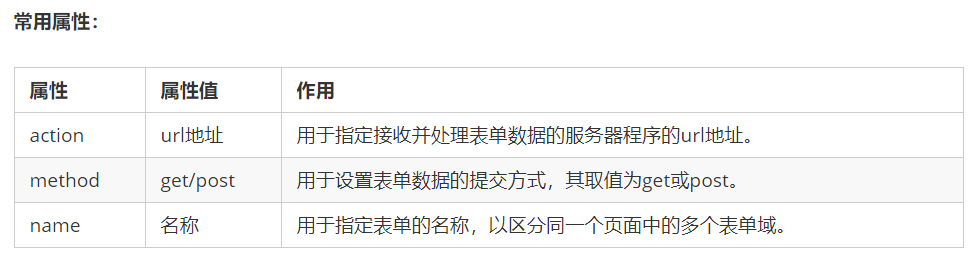

基础班来说,我们暂时不用表单域提交数据,只需要写上 form 标签即可.  就业班等学习服务器编程阶段会重新讲解.
这里只需要记住两点:
1.在我们写表单元素之前,应该有个表单域把他们进行包含.
2.表单域是 form标签.

###表单控件(表单元素)

表单域中可以定义各种表单元素，这些**表单元素就是允许用户在表单中输入或者选择的内容控件。**

> 1. input输入表单元素
> 2. select下拉表单元素
> 3. textarea 文本域元素

#### input表单元素

在英文单词中，input 是输入的意思，而在表单元素中 **<input> 标签用于收集用户信息。**

在 <input> 标签中，包含**<font color='red'>一个 type 属性，根据不同的 type 属性值，输入字段拥有很多种形式（可以是文本字段、复选框、掩码后的文本控件、单选按钮、按钮等）。</font>**


> - <input /> 标签为单标签
> - <font color='blue'>type 属性设置不同的属性值用来指定不同的控件类型</font>

type 属性的属性值及其描述如下：


除 type 属性外，<input>标签还有其他很多属性，其常用属性如下：


> 1. name 和value 是每个表单元素都有的属性值，主要给后台人员使用.
> 2. name 表单元素的名字, 要求 <font color='red'>单选按钮和复选框要有相同的name值.</font>
> 3. **checked属性主要针对于单选按钮和复选框, 主要作用一打开页面,就要可以默认选中某个表单元素.**
> 4. maxlength 是用户可以在表单元素输入的最大字符数, 一般较少使用.


###label标签

> <label> 标签**为 input 元素定义标注（标签）。**
>
> <label> 标签<font color='red'>用于绑定一个表单元素</font>, 当点击<label> 标签内的文本时，<font color='green'>浏览器就会自动将焦点(光标)转到或者选择对应的表单元素上,用来增加用户体验.</font>

语法：


核心： <label> **<font color='red'>标签的 for 属性应当与相关元素的 id 属性相同。</font>**

#### select表单元素

使用场景: 在页面中，如果**有多个选项让用户选择，并且想要节约页面空间时**，我们可以使用<select><font color='red'>标签控件定义下拉列表。</font>

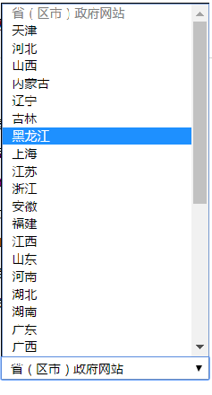

语法： 


####textarea表单元素

> 1. 使用场景：**当用户输入内容较多的情况下**，我们就不能使用文本框表单了，此时我们可以使用 <textarea> 标签。
> 2. 在表单元素中，<textarea> <font color='red'>标签是用于定义多行文本输入的控件。</font>
> 3. 使用多行文本输入控件，可以输入更多的文字，该控件常见于留言板，评论。


表单元素我们学习了三大控件：<font color='red'>input 输入表单元素 </font>、<font color='orange'> select 下拉表单元素</font> 、<font color='green'> textarea 文本域表单元素</font>

**<font color='red'>这三组表单元素都应该包含在form表单域里面,并且有 name 属性.</font>**

具体代码：


有三个名字非常相似的标签：

1. 表单域   form    使用场景:  提交区域内表单元素给后台服务器
2. 文件域   file ：是input type 属性值   使用场景: 上传文件文本域   t
3. extarea    使用场景:  可以输入多行文字, 比如留言板  网站介绍等…

我们当前阶段不需要提交表单元素,所以我们只负责表单元素的外观形态即可.

###查阅文档：

> 经常查阅文档是一个非常好的学习习惯。
>
> 推荐的网址： 
> 百度:  http://www.baidu.com
> W3C :  http://www.w3school.com.cn/
> MDN: https://developer.mozilla.org/zh-CN/

#css

###css简介

> CSS 的主要使用场景就是美化网页,布局页面的.
> 1. HTML 的局限性
> 2. CSS-网页的美容师

> <font color='red'>CSS 是层叠样式表 ( Cascading Style Sheets ) 的简称.</font>
>
> 有时我们也会称之为 **CSS 样式表或级联样式表。**
>
> <font color='blue'>CSS 是也是一种标记语言</font>
>
> - CSS 主要用于设置 HTML 页面中的文本内容（字体、大小、对齐方式等）、图片的外形（宽高、边框样式、边距等）以及版面的布局和外观显示样式。
> - CSS 让我们的网页更加丰富多彩，布局更加灵活自如。简单理解：CSS 可以美化 HTML , 让 HTML 更漂亮， 让页面布局更简单。
> - CSS 最大价值: 由 HTML 专注去做结构呈现，样式交给 CSS，即 结构 ( HTML ) 与样式( CSS ) 相分离

**总结：**

> 1. HTML主要做结构,显示元素内容.
> 2. CSS 美化 HTML ,布局网页.
> 3. CSS 最大价值: 由 HTML 专注去做结构呈现，样式交给 CSS，即 结构 ( HTML ) 与样式( CSS ) 相分离。

###css语法规范

1. 使用 HTML 时，需要遵从一定的规范，CSS 也是如此。要想熟练地使用 CSS 对网页进行修饰，首先需要了解CSS 样式规则。

2. CSS 规则由两个主要的部分构成：<font color='red'>选择器以及一条或多条声明。</font>


> 1. 选择器是用于指定 CSS 样式的 HTML 标签，花括号内是对该对象设置的具体样式
> 2. 属性和属性值以“键值对”的形式出现
> 3. 属性是对指定的对象设置的样式属性，例如字体大小、文本颜色等
>
> 4. <font color='red'>属性和属性值之间用英文“:”分开</font>
> 5. 多个“键值对”之间用英文“;”进行区分

例如：

所有的样式，都包含在 <style> 标签内，表示是样式表。<style> 一般写到 </head> 上方


###css代码风格：

> 1. 样式格式书写
> 2. 样式大小写风格
> 3. 样式空格风格

#### 1、样式格式书写


#### 2、样式大小写


#### 3、空格规范


###css选择器的作用

答：<font color='red'>选择器(选择符)就是根据不同需求把不同的标签选出来这就是选择器的作用</font>。  简单来说，就是选择标签用的。

​    

以上CSS做了两件事：

- 找到所有的 h1 标签。  选择器（选对人）
- 设置这些标签的样式，比如颜色为红色（做对事）。

## 选择器分类

> <font color='red'>选择器分为基础选择器和复合选择器两个大类</font>，我们这里先讲解一下基础选择器。
>
> - 基础选择器是由单个选择器组成的
> - 基础选择器又包括：标签选择器、类选择器、id 选择器和通配符选择器

##css基础选择器

**<font color='red'>基础选择器又包括：标签选择器、类选择器、id 选择器和通配符选择器</font>**

###标签选择器：

> 标签选择器（元素选择器）是**指用 HTML 标签名称作为选择器，按标签名称分类，为页面中某一类标签指定统一的 CSS 样式。**

语法：


###类选择器

> 如果想要差异化选择不同的标签，**单独选一个或者某几个标签，可以使用类选择器。**

语法：


> 类选择器在 HTML 中以 class 属性表示，在 CSS 中，类选择器以一个点“.”号显示。


> 1. 如果想要差异化选择不同的标签，<font color='red'>单独选一个或者某几个标签，可以使用类选择器。</font>
> 2. 类选择器在 HTML 中以 class 属性表示，在 CSS 中，类选择器以一个点“.”号显示。
> 3. 类选择器使用“.”（英文点号）进行标识，后面紧跟类名（自定义，我们自己命名的）。
> 4. 可以理解为给这个标签起了一个名字，来表示。
> 5. **长名称或词组可以使用中横线来为选择器命名。**
> 6. 不要使用纯数字、中文等命名，尽量使用英文字母来表示。
> 7. 命名要有意义，尽量使别人一眼就知道这个类名的目的。
> 8. 命名规范：见附件（ Web 前端开发规范手册.doc）

###多类名选择器

> 我们可以给一个标签指定多个类名，从而达到更多的选择目的。 **这些类名都可以选出这个标签。**
>
> 简单理解就是一个标签有多个名字. 


1、多类名使用方式


2、多类名开发中使用场景

> (1) 可以把一些标签元素相同的样式(共同的部分)放到一个类里面.
> (2) 这些标签都可以调用这个公共的类,然后再调用自己独有的类.
> (3) 从而节省CSS代码,统一修改也非常方便.


注意：
        1.在标签class 属性中写多个类名
        2.多个类名中间必须用空格分开
        3.这个标签就可以分别具有这些类名的样式

###id选择器：

> <font color='red'>id 选择器可以为标有特定 id 的 HTML 元素指定特定的样式。</font>
>
> HTML 元素以 id 属性来设置 id 选择器，CSS 中 id 选择器以“#" 来定义。


###id选择器和类选择器的区别：

> ① 类选择器（class）好比人的名字，一个人可以有多个名字，同时一个名字也可以被多个人使用。
>
> ② id 选择器好比人的身份证号码，全中国是唯一的，不得重复。
>
> ③ id 选择器和类选择器最大的不同在于使用次数上。
>
> ④ 类选择器在修改样式中用的最多，id 选择器一般用于页面唯一性的元素上，经常和 JavaScript 搭配使用。

###通配符选择器：

> 在 CSS 中，<font color='red'>通配符选择器使用“*****”定义，它表示选取页面中所有元素（标签）。</font>


###选择器总结


##css字体属性

### 字体系列

> **CSS 使用 <font color='red'>font-family </font>属性定义文本的字体系列。**


###字体大小

> **CSS 使用 <font color='blue'>font-size</font> 属性定义字体大小。** 


###字体粗细

> **CSS 使用 <font color='green'>font-weight </font>属性设置文本字体的粗细。**

语法：


1.学会让加粗标签（比如 h 和 strong 等) 不加粗，或者其他标签加粗
2.实际开发时，我们更喜欢用数字表示粗细

###字体样式(文字倾斜)

> **CSS 使用 <font color='red'>font-style</font> 属性设置文本的风格。**

语法：


###字体的复合属性

字体属性可以把以上文字样式综合来写, 这样可以更节约代码:


- 使用 font 属性时，<font color='red'>必须按上面语法格式中的顺序书写，不能更换顺序，</font>并且各个属性间以空格隔开 不需要设置的
- 属性可以省略（取默认值），但<font color='blue'>必须保留 font-size 和 font-family 属性，否则 font 属性将不起作用</font>

###字体总结：


##css文本属性

###文本颜色

> **<font color='orange'>color 属性用于定义文本的颜色。</font>**

语法：


开发中最常用的是十六进制

###文本对齐

> **<font color='blue'>text-align 属性用于设置元素内文本内容的水平对齐方式。</font>**

语法：


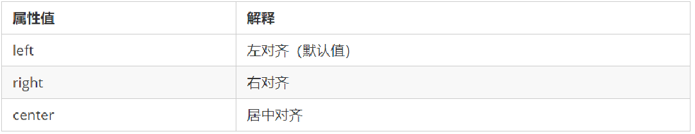

###修饰文本

> **text-decoration 属性规定添加到文本的修饰。可以<font color='blue'>给文本添加下划线、删除线、上划线等。</font>**

语法：


**重点记住如何添加下划线 ? 如何删除下划线 ?** 其余了解即可。

###文本缩进

> **text-indent** 属性用来<font color='red'>指定文本的第一行的缩进，通常是将段落的首行缩进。</font>

语法：


###行间距

> **<font color='red'>line-height 属性用于设置行间的距离（行高）。可以控制文字行与行之间的距离.</font>**

语法：


**行间距 = 上间距 + 文本高度 + 下间距**

**文本属性总结：**


##css样式表

> 按照 CSS 样式书写的位置（或者引入的方式），CSS 样式表可以分为三大类：
> 1. 行内样式表（行内式）
> 2. 内部样式表（嵌入式）
> 3. 外部样式表（链接式）

###行内样式表（行内式）

> 行内样式表（内联样式表）是<font color='red'>在元素标签内部的 style 属性中设定 CSS 样式。</font>适合于修改简单样式.


###内部样式表（嵌入式）

> <font color='red'>内部样式表（内嵌样式表）是写到html页面内部。</font>是将所有的 CSS 代码抽取出来，单独放到一个 <style> 标签中。


###外部样式表（链接式）

> 实际开发都是外部样式表。适合于样式比较多的情况。
>
> <font color='red'>核心是：样式单独写到CSS 文件中，之后把CSS文件引入到 HTML 页面中使用。</font>
>
> 引入外部样式表分为两步：
>
> 1. 新建一个后缀名为 .css 的样式文件，把所有 CSS 代码都放入此文件中。
> 2. 在 HTML 页面中，使用<link> 标签引入这个文件。


##Chrome调试工具：


 1.Ctrl+滚轮 可以放大开发者工具代码大小。
 2.左边是 HTML 元素结构，右边是 CSS 样式。
 3.右边 CSS 样式可以改动数值（左右箭头或者直接输入）和查看颜色。
 4.Ctrl + 0 复原浏览器大小。
 5.如果点击元素，发现右侧没有样式引入，极有可能是类名或者样式引入错误。
 6.如果有样式，但是样式前面有黄色叹号提示，则是样式属性书写错误。

# emmet语法

### 1、简介

Emmet语法的前身是Zen coding,它使用缩写,来提高html/css的编写速度, Vscode内部已经集成该语法。

1. 快速生成HTML结构语法

2. 快速生成CSS样式语法


### 2、快速生成HTML结构语法

- 生成标签 直接输入标签名 按tab键即可   比如  div   然后tab 键， 就可以生成 <div></div>
- 如果想要生成多个相同标签  加上 * 就可以了 比如   div*3  就可以快速生成3个div
- 如果有父子级关系的标签，可以用 >  比如   ul > li就可以了
- 如果有兄弟关系的标签，用  +  就可以了 比如 div+p  
- 如果生成带有类名或者id名字的，  直接写  .demo  或者  #two   tab 键就可以了
- 如果生成的div 类名是有顺序的， 可以用 自增符号  $ 
- 如果想要在生成的标签内部写内容可以用  { }  表示

### 3、快速生成CSS样式语法

CSS 基本采取简写形式即可

- 比如 w200   按tab  可以 生成  width: 200px;

- 比如 lh26px   按tab  可以生成  line-height: 26px;


### 4、快速格式化代码

Vscode  快速格式化代码:   shift+alt+f

也可以设置 当我们 保存页面的时候自动格式化代码:

1）文件 ------.>【首选项】---------->【设置】；

2）搜索emmet.include;

3）在settings.json下的【工作区设置】中添加以下语句：

​		"editor.formatOnType": true,

​		"editor.formatOnSave": true

## css的复合选择器

### 1、什么是复合选择器？

> 在 CSS 中，**可以根据选择器的类型把选择器分为基础选择器和复合选择器，**<font color='red'>复合选择器是建立在基础选择器之上，对基本选择器进行组合形成的。</font>
>
> - 复合选择器可以更准确、更高效的选择目标元素（标签）
> - 复合选择器是由两个或多个基础选择器，通过不同的方式组合而成的
> - 常用的复合选择器包括：后代选择器、子选择器、并集选择器、伪类选择器等等

### 2、后代选择器 (重要）

**定义：**

> 后代选择器又称为包含选择器，可以选择父元素里面子元素。其写法就是把外层标签写在前面，内层标签写在后面，中间用空格分隔。当标签发生嵌套时，内层标签就成为外层标签的后代。
>

**语法：**


上述语法表示<font color='red'>选择元素 1 里面的所有元素 2 (后代元素)。</font>


**语法说明**：

- 元素1 和 元素2 中间用空格隔开
- 元素1 是父级，元素2 是子级，最终选择的是元素2
- 元素2 可以是儿子，也可以是孙子等，只要是元素1 的后代即可
- 元素1 和 元素2 可以是任意基础选择器

### 3、子选择器 (重要）

**定义：**

> 子元素选择器（子选择器）只能选择作为某元素的最近一级子元素。
>
> （简单理解就是选亲儿子元素）

**语法：**


上述语法表示<font color='red'>选择元素1 里面的所有直接后代(子元素) 元素2。</font>

**语法说明**：

- 元素1 和 元素2 中间用 大于号 隔开
- <font color='red'>元素1 是父级，元素2 是子级，最终选择的是元素2</font>
- 元素2 必须是亲儿子，其孙子、重孙之类都不归他管. 你也可以叫他 亲儿子选择器

**例子：**


### 4、并集选择器 (重要）

**定义：**

> <font color='red'>并集选择器可以选择多组标签, 同时为他们定义相同的样式，通常用于集体声明。</font>
>
> 并集选择器是各选择器通过英文逗号（,）连接而成，任何形式的选择器都可以作为并集选择器的一部分。

**语法：**


上述语法表示选择元素1 和 元素2。

**语法说明**：

- 元素1 和 元素2 中间用逗号隔开
- 逗号可以理解为<font color='red'>和</font>的意思
- 并集选择器通常用于集体声明

**例子：**

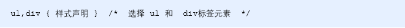

### 5、伪类选择器

**定义：**

> **<font color='red'>伪类选择器用于向某些选择器添加特殊的效果</font>，比如给链接添加特殊效果，或选择第1个，第n个元素。**

**语法：**

> <font color='green'>伪类选择器书写最大的特点是用冒号（:）表示，比如 :hover 、 :first-child 。</font>

### 6、链接伪类选择器

**定义：**

> 伪类选择器用于向某些选择器添加特殊的效果，比如给链接添加特殊效果，或选择第1个，第n个元素。
>


**语法：**

​		**伪类选择器书写最大的特点是用冒号（:）表示，比如 :hover 、 :first-child 。**

> a:link	没有点击过的(访问过的)链接
>
> a:visited	点击过的(访问过的)链接
>
> a:hover	鼠标经过的那个链接
>
> a:active	鼠标正在按下还没有弹起鼠标的那个链接

**链接伪类选择器注意事项**

​		为了确保生效，请按照 LVHA 的循顺序声明 :link－:visited－:hover－:active。

​		记忆法：love hate 或者 lv 包包 hao 。

​		因为 a 链接在浏览器中具有默认样式，所以我们实际工作中都需要给链接单独指定样式。

### 7、:focus 伪类选择器

**定义：**

> **<font color='red'>:focus 伪类选择器用于选取获得焦点的表单元素。</font>**
>
> 焦点就是光标，一般情况 <input> 类表单元素才能获取

例子：


### 复合选择器总结

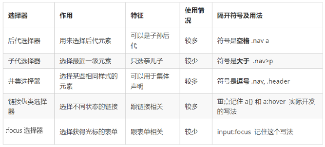

## 三、css的显示模式

### 1、什么是元素的显示模式

**定义：**

> <font color='red'>元素显示模式就是元素（标签）以什么方式进行显示，</font>比如<div>自己占一行，比如一行可以放多个<span>。

**作用：**

> 网页的标签非常多，在不同地方会用到不同类型的标签，了解他们的特点可以更好的布局我们的网页。
>

### 2、元素显示模式的分类

> <font color='red'>HTML 元素一般分为块元素和行内元素两种类型。</font>

#### 2.1、块元素

**常见的块元素**：

```
<h1>~<h6>、<p>、<div>、<ul>、<ol>、<li>
```

<font color='red'><div> 标签是最典型的块元素。</font>

**块级元素的特点**：

- 比较霸道，自己独占一行。
- 高度，宽度、外边距以及内边距都可以控制。
- <font color='red'>宽度默认是容器（父级宽度）的100%。</font>
- 是一个容器及盒子，里面可以放行内或者块级元素。


#### 2.2、行内元素

**常见的行内元素：**

```
<a>、<strong>、<b>、<em>、<i>、<del>、<s>、<ins>、<u>、<span>
```

<font color='red'><span> 标签是最典型的行内元素。有的地方也将行内元素称为内联元素。</font>

**行内元素的特点：**

- 相邻行内元素在一行上，**一行可以显示多个。**

- 高、宽直接设置是无效的。

- **默认宽度就是它本身内容的宽度。**

- 行内元素只能容纳文本或其他行内元素。

**注意：**

> 1. 链接里面不能再放链接
> 2. 特殊情况链接 <a> 里面可以放块级元素，但是给 <a> 转换一下块级模式最安全

#### 2.3、行内块元素

**常见的行内块标签**：

```
、<input />、<td>
```

> **<font color='red'>它们同时具有块元素和行内元素的特点。</font>有些资料称它们为行内块元素。**

**行内块元素的特点**：

> - **和相邻行内元素（行内块）在一行上，但是他们之间会有空白缝隙。**
> - **一行可以显示多个（行内元素特点）。**
> - 默认宽度就是它本身内容的宽度（行内元素特点）。
> - 高度，行高、外边距以及内边距都可以控制（块级元素特点）。

#### 2.4、元素显示模式总结


学习元素显示模式的主要目的就是分清它们各自的特点，当我们网页布局的时候，在合适的地方用合适的标签元素。

### 3、元素显示模式的转换

**简单理解**: 

> **一个模式的元素需要另外一种模式的特性**
>
> 比如想要增加链接 <a> 的触发范围。   

**转换方式**

> - <font color='red'>转换为块元素：</font>display:block;
> - <font color='red'>转换为行内元素：</font>display:inline;
> - <font color='red'>转换为行内块：</font>display: inline-block;

### 4、单行文字垂直居中的代码


**简单理解**: 

​		行高的上空隙和下空隙把文字挤到中间了，

​		如果行高小于盒子高度，文字会偏上，

​		如果行高大于盒子高度，则文字偏下。

## css的背景

通过 CSS 背景属性，可以给页面元素添加背景样式。

背景属性可以设置背景颜色、背景图片、背景平铺、背景图片位置、背景图像固定等。

### 1、背景颜色

**样式名称**：

> <font color='red'>background-color 定义元素的背景颜色</font>

**使用方式**：

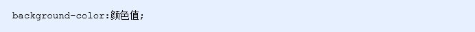

**其他说明**：

> <font color='red'>元素背景颜色默认值是 transparent（透明）</font>


### 2、背景图片

**样式名称**：

> <font color='red'>background-image  定义元素的背景图片</font>

**使用方式**：


**其他说明**：

实际开发常见于 logo 或者一些装饰性的小图片或者是超大的背景图片, 优点是非常便于控制位置. (精灵图也是一种运用场景)

> 注意：背景图片后面的地址，千万不要忘记加 URL， 同时里面的路径**不要加引号**。
>

### 3、背景平铺

**样式名称：**

> <font color='red'>background-repeat 设置元素背景图像的平铺</font> 

**使用方式：**

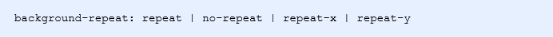


### 4、背景图片位置

**样式名称：**

> <font color='red'>background-position 属性可以改变图片在背景中的位置</font>

**使用方式：**

​		

<font color='red'>参数代表的意思是：x 坐标和 y 坐标。 可以使用 方位名词 或者 精确单位</font>


**其他说明：**

> 1、参数是方位名词
>
> ​		如果指定的两个值都是方位名词，则两个值前后顺序无关，比如 left  top 和 top  left 效果一致
>
> ​		如果只指定了一个方位名词，另一个值省略，则第二个值默认居中对齐
>
> 2、参数是精确单位
>
> ​		如果参数值是精确坐标，那么第一个肯定是 x 坐标，第二个一定是 y 坐标
>
> ​		如果只指定一个数值，那该数值一定是 x 坐标，另一个默认垂直居中
>
> 3、参数是混合单位
>
> ​		如果指定的两个值是精确单位和方位名词混合使用，则第一个值是 x 坐标，第二个值是 y 坐标

### 5、背景图片固定

**样式名称：**

> <font color='red'>background-attachment 属性设置背景图像是否固定或者随着页面的其余部分滚动。</font>

**使用方式：**

​		

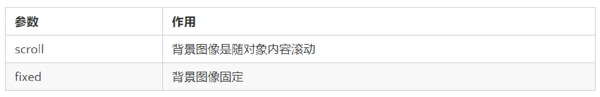

**其他说明：**

> background-attachment 后期可以制作视差滚动的效果。
>

### 6、背景样式合写

**背景合写样式：**

> <font color='red'>background: 背景颜色 背景图片地址 背景平铺 背景图像滚动 背景图片位置;</font>

**使用方式：**


### 7、背景色半透明

> CSS3 提供了背景颜色半透明的效果。 
>

**使用方式：**


- 最后一个参数是 alpha 透明度，取值范围在 0~1之间
- 我们习惯把 0.3 的 0 省略掉，写为 background: rgba(0, 0, 0, .3);

**注意**：

- 背景半透明是指盒子背景半透明，盒子里面的内容不受影响
- CSS3 新增属性，是 IE9+ 版本浏览器才支持的，但是现在实际开发,我们不太关注兼容性写法了,可以放心使用

### 8、背景总结


## 一、css三大特性

> CSS 有三个非常重要的三个特性：<font color='red'>层叠性、继承性、优先级。</font>

### 1、层叠性

> <font color='red'>相同选择器给设置相同的样式，此时一个样式就会覆盖（层叠）另一个冲突的样式。层叠性主要解决样式冲突的问题</font>
>
> 层叠性原则:
>
> - 样式冲突，遵循的原则是就近原则，哪个样式离结构近，就执行哪个样式
> - 样式不冲突，不会层叠


### 2、继承性

> CSS中的继承: <font color='red'>子标签会继承父标签的某些样式</font>，如文本颜色和字号。恰当地使用继承可以简化代码，降低 CSS 样式的复杂性。
>

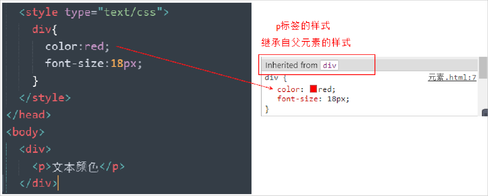

子元素可以继承父元素的样式：

（text-，font-，line-这些元素开头的可以继承，以及color属性）

继承性口诀：龙生龙，凤生凤，老鼠生的孩子会打洞

**行高的继承性：**

```css
 body {
   font:12px/1.5 Microsoft YaHei；
 }
```

- 行高可以跟单位也可以不跟单位
- 如果子元素没有设置行高，则会继承父元素的行高为 1.5
- 此时子元素的行高是：当前子元素的文字大小 * 1.5
- <font color='red'>body 行高 1.5  这样写法最大的优势就是里面子元素可以根据自己文字大小自动调整行高</font>

### 3、优先级

> 当同一个元素指定多个选择器，就会有优先级的产生。
>
> - 选择器相同，则执行层叠性
> - 选择器不同，则根据选择器权重执行

选择器优先级计算表格：


> 优先级注意点:
>
> 1. 权重是有4组数字组成,但是不会有进位。
>
> 2. 可以理解为<font color='red'>类选择器永远大于元素选择器, id选择器永远大于类选择器,</font>以此类推..
>
> 3. 等级判断从左向右，如果某一位数值相同，则判断下一位数值。
>
> 4. 可以简单记忆法:  通配符和继承权重为0, 标签选择器为1,类(伪类)选择器为 10, id选择器 100, 行内样式表为 1000, <font color='red'>!important 无穷大.</font>
>
> 5. 继承的权重是0， 如果该元素没有直接选中，不管父元素权重多高，子元素得到的权重都是 0。

> <font color='red'>权重叠加：如果是复合选择器，则会有权重叠加，需要计算权重。</font>
>
> - div ul  li   ------>      0,0,0,3
> - .nav ul li   ------>      0,0,1,2
> - a:hover      -----—>   0,0,1,1
> - .nav a       ------>      0,0,1,1


## 二、盒子模型

### 1、网页布局的本质

网页布局的核心本质： 就是利用 CSS 摆盒子。


> 网页布局过程：
>
> 1. 先准备好相关的网页元素，网页元素基本都是盒子 Box 。
> 2. 利用 CSS 设置好盒子样式，然后摆放到相应位置。
> 3. 往盒子里面装内容

### 2、盒子模型（Box Model）组成

> 盒子模型：把 HTML 页面中的布局元素看作是一个矩形的盒子，也就是一个盛装内容的容器。
>
> CSS 盒子模型本质上是一个盒子，封装周围的 HTML 元素，它包括：**边框**、**外边距**、**内边距**、和 **实际内容**


### 3、边框（border）

#### 3.1、边框的使用

1、<font color='red'>border可以设置元素的边框。</font>边框有三部分组成：边框宽度(粗细) 边框样式  边框颜色；

2、语法：

```css
 border : border-width || border-style || border-color;   
```


> 边框样式 border-style 可以设置如下值：
>
> - none：没有边框即忽略所有边框的宽度（默认值）
> - solid：边框为单实线(最为常用的)
> - dashed：边框为虚线  
> - dotted：边框为点线

3、边框的合写分写

边框简写：

```css
 border: 1px solid red;  
```

边框分开写法：

```css
 border-top: 1px solid red;  /* 只设定上边框， 其余同理 */   
```

#### 3.2、表格的细线边框

1、<font color='red'>border-collapse 属性控制浏览器绘制表格边框的方式。它控制相邻单元格的边框。</font>

2、语法：

```css
 border-collapse:collapse; 
```

collapse 单词是合并的意思

**<font color='blue'>border-collapse: collapse; 表示相邻边框合并在一起</font>**

#### 3.3、边框会影响盒子实际大小

> 边框会额外增加盒子的实际大小。因此我们有两种方案解决：
>
> - 测量盒子大小的时候,不量边框。
> - 如果测量的时候包含了边框,则需要 width/height 减去边框宽度

### 4、内边距（padding）

#### 4.1、内边距的使用方式

1、<font color='red'>padding 属性用于设置内边距，即边框与内容之间的距离。</font>

2、语法：

合写属性：


分写属性：


#### 4.2、内边距会影响盒子实际大小

> 1、当我们给盒子指定 padding 值之后，发生了 2 件事情：
>
> 1. 内容和边框有了距离，添加了内边距。
> 2. padding影响了盒子实际大小。
>
> 2、内边距对盒子大小的影响：
>
> - <font color='red'>如果盒子已经有了宽度和高度，此时再指定内边框，会撑大盒子。</font>
> - **<font color='blue'>如果盒子本身没有指定width/height属性, 则此时padding不会撑开盒子大小。</font>**
>
> 3、解决方案：
>
> - <font color='red'>如果保证盒子跟效果图大小保持一致，则让 width/height 减去多出来的内边距大小即可。</font>

### 5、外边距（margin）

#### 5.1、外边距的使用方式

> **margin 属性用于设置外边距，即控制盒子和盒子之间的距离。**


#### 5.2、外边距典型应用

> <font color='red'>**外边距可以让块级盒子水平居中的两个条件：！！！**</font>
>
> - **盒子必须指定了宽度（width）。**
> - **盒子左右的外边距都设置为 auto 。**
>

常见的写法，以下三种都可以：

```css
margin-left: auto;   margin-right: auto;

margin: auto;

margin: 0 auto;
```

注意：以上方法是让块级元素水平居中，**<font color='orange'>行内元素或者行内块元素水平居中给其父元素添加 text-align:center 即可。</font>**

#### 5.3、外边距合并

使用 margin 定义<font color='red'>块元素</font>的垂直外边距时，可能会出现外边距的合并。

主要有两种情况：

> 1. 相邻块元素垂直外边距的合并
> 2. 嵌套块元素垂直外边距的塌陷

**1、相邻块元素垂直外边距的合并**

> 当上下相邻的两个块元素（兄弟关系）相遇时，如果上面的元素有下外边距 margin-bottom，下面的元素有上外边距 margin-top ，**则他们之间的垂直间距不是 margin-bottom 与 margin-top 之和。取两个值中的较大者这种现象被称为相邻块元素垂直外边距的合并。**
>


> 解决方案：
> 		<font color='red'>尽量只给一个盒子添加 margin 值。</font>

**2、嵌套块元素垂直外边距的塌陷**

> 对于两个嵌套关系（父子关系）的块元素，父元素有上外边距同时子元素也有上外边距，此时父元素会塌陷较大的外边距值。
>


> **解决方案：**
>
> - <font color='blue'>可以为父元素定义上边框。</font>
> - <font color='blue'>可以为父元素定义上内边距。</font>
> - <font color='green'>可以为父元素添加 overflow:hidden。</font>
>

#### 5.4、清除内外边距

​		网页元素很多都带有默认的内外边距，而且不同浏览器默认的也不一致。因此我们在布局前，首先要清除下网页元素的内外边距。

```css
 * {
    padding:0;   /* 清除内边距 */
    margin:0;    /* 清除外边距 */
  }
```

<font color='red'>注意：行内元素为了照顾兼容性，尽量只设置左右内外边距，不要设置上下内外边距。但是转换为块级和行内块元素就可以了</font>

## 三、PS 基本操作

因为网页美工大部分效果图都是利用 PS（Photoshop）来做的，所以以后我们大部分切图工作都是在 PS 里面完成。

> 部分操作：
>
> - <font color='red'>文件→打开</font> ：可以打开我们要测量的图片
> - <font color='red'>Ctrl+R</font>：可以打开标尺，或者 视图→标尺
> - 右击标尺，把里面的单位改为像素
> - Ctrl+ 加号(+)可以放大视图， Ctrl+ 减号(-)可以缩小视图
> - 按住空格键，鼠标可以变成小手，拖动 PS 视图
> - 用选区拖动  可以测量大小
> - Ctrl+ D 可以取消选区，或者在旁边空白处点击一下也可以取消选区
>


案例：


# CSS3样式

## 一、其他样式	

### 1、圆角边框

在 CSS3 中，新增了<font color='red'>圆角边框</font>样式，这样我们的盒子就可以变圆角了。

> **border-radius 属性用于设置元素的外边框圆角。**

语法：

```css
 border-radius:length;    
```

> - 参数值可以为数值或百分比的形式
> - <font color='red'>如果是正方形，想要设置为一个圆，把数值修改为高度或者宽度的一半即可，或者直接写为 50%</font>
> - 该属性是一个简写属性，可以跟四个值，分别代表**左上角、右上角、右下角、左下角**
> - 分开写：border-top-left-radius、border-top-right-radius、border-bottom-right-radius 和border-bottom-left-radius
> - 兼容性 ie9+ 浏览器支持, 但是不会影响页面布局,可以放心使用
>

### 2、盒子阴影

> CSS3 中新增了盒子阴影，我们可以<font color='red'>使用 box-shadow 属性为盒子添加阴影。</font>

语法：

```css
 box-shadow: h-shadow v-shadow blur spread color inset; 
```


> 注意：
> 1. 默认的是外阴影(outset), 但是不可以写这个单词,否则造成阴影无效
> 2. **盒子阴影不占用空间，不会影响其他盒子排列。**

### 3、文字阴影

> 在 CSS3 中，我们可以**<font color='blue'>使用 text-shadow 属性将阴影应用于文本。</font>**

语法：

```css
 text-shadow: h-shadow v-shadow blur color;
```


## 二、浮动

### 1、传统网页布局的三种方式

**网页布局的本质——用 CSS 来摆放盒子。 把盒子摆放到相应位置.**

> CSS 提供了三种传统布局方式(简单说,就是盒子如何进行排列顺序)：
>
> - 普通流（标准流）
> - 浮动
> - 定位
>

这三种布局方式都是用来摆放盒子的，盒子摆放到合适位置，布局自然就完成了。

注意：实际开发中，一个页面基本都包含了这三种布局方式（后面移动端学习新的布局方式） 。

### 2、标准流（普通流/文档流）

> <font color='red'>所谓的标准流:  就是标签按照规定好默认方式排列</font>
>
> 1. 块级元素会独占一行，从上向下顺序排列。常用元素：div、hr、p、h1~h6、ul、ol、dl、form、table
> 2. 行内元素会按照顺序，从左到右顺序排列，碰到父元素边缘则自动换行。常用元素：span、a、i、em 等 
>
> 以上都是标准流布局，我们前面学习的就是标准流，标准流是最基本的布局方式。
>

### 3、为什么需要浮动？


> 1. 总结： 有很多的布局效果，标准流没有办法完成，此时就可以利用浮动完成布局。 因为浮动可以改变元素标签默认的排列方式.
>
> 2. 浮动最典型的应用：可以让多个块级元素一行内排列显示。
>
> 3. 网页布局第一准则：**<font color='red'>多个块级元素纵向排列找标准流，多个块级元素横向排列找浮动</font>**。
>

### 4、什么是浮动？

> <font color='red'>float 属性用于创建浮动框，将其移动到一边，直到左边缘或右边缘触及包含块或另一个浮动框的边缘。</font>

语法：

```css
 选择器 { float: 属性值; }
```


### 5、浮动特性

> 加了浮动之后的元素,会具有很多特性,需要我们掌握的.
>

<font color='red'>1、浮动元素会脱离标准流(**脱标：浮动的盒子不再保留原先的位置**)</font>


<font color='orange'>2、如果多个盒子都设置了浮动，则它们会按照属性值一行内显示并且顶端对齐排列。</font>


> 注意： 
>
> <font color='red'>浮动的元素是互相贴靠在一起的（不会有缝隙），如果父级宽度装不下这些浮动的盒子，多出的盒子会另起一行对齐。</font>

<font color='blue'>3、浮动的元素会具有行内块元素的特性</font>

> 1. 如果块级盒子没有设置宽度，默认宽度和父级一样宽，但是**添加浮动后，它的大小根据内容来决定**
> 2. **浮动的盒子中间是没有缝隙的，是紧挨着一起的**
> 3. 行内元素同理

### 6、浮动元素经常和标准流父级搭配使用

为了约束浮动元素位置, 我们网页布局一般采取的策略是:

**<font color='blue'>先用标准流父元素排列上下位置，之后内部子元素采取浮动排列左右位置，符合网页布局第一准侧</font>**

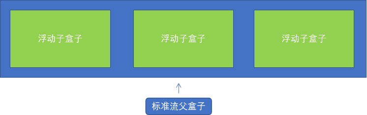


## 三、常见网页布局


### 浮动布局注意点

> **1、浮动和标准流的父盒子搭配。**
>
> <font color='red'>先用标准流的父元素排列上下位置, 之后内部子元素采取浮动排列左右位置</font>
>
> **2、一个元素浮动了，理论上其余的兄弟元素也要浮动。**
>
> 一个盒子里面有多个子盒子，如果其中一个盒子浮动了，其他兄弟也应该浮动，以防止引起问题。
>
> <font color='red'>浮动的盒子只会影响浮动盒子后面的标准流,不会影响前面的标准流.</font>

## 四、清除浮动

### 1、为什么需要清除浮动？

**由于父级盒子很多情况下，不方便给高度，但是子盒子浮动又不占有位置，最后父级盒子高度为 0 时，就会影响下面的标准流盒子。**


- <font color='red'>由于浮动元素不再占用原文档流的位置，所以它会对后面的元素排版产生影响</font>

### 2、清除浮动本质

> <font color='blue'>**清除浮动的本质是清除浮动元素造成的影响：浮动的子标签无法撑开父盒子的高度**</font>
>
> 注意：
>
> - <font color='red'>如果父盒子本身有高度，则不需要清除浮动</font>
> - <font color='orange'>清除浮动之后，父级就会根据浮动的子盒子自动检测高度。</font>
> - 父级有了高度，就不会影响下面的标准流了
>

### 3、清除浮动样式

语法：

```css
 选择器{clear:属性值;} 
```


我们实际工作中， 几乎只用 <font color='red'>clear: both;</font>

<font color='red'>清除浮动的策略是:  闭合浮动. </font>

### 4、清除浮动的多种方式

> 1. 额外标签法也称为隔墙法，是 W3C 推荐的做法。
> 2. <font color='red'>父级添加 overflow 属性</font>
> 3. <font color='red'>父级添加after伪元素</font>
> 4. <font color='red'>父级添加双伪元素</font>

#### 4.1、额外标签法

> 额外标签法也称为隔墙法，是 W3C 推荐的做法。
>

使用方式：

<font color='red'>额外标签法会在浮动元素末尾添加一个空的标签。</font>

```html
例如 <div style="clear:both"></div>，或者其他标签（如<br />等）。
```

> 优点： 通俗易懂，书写方便
>
> 缺点： 添加许多无意义的标签，结构化较差
>
> 注意： <font color='red'>要求这个新的空标签必须是块级元素。</font>

> **总结:**
>
> ​	1、清除浮动本质是?
>
> ​			<font color='red'>清除浮动的本质是清除浮动元素脱离标准流造成的影响</font>
>
> ​	2、清除浮动策略是?
>
> ​			<font color='red'>闭合浮动.  只让浮动在父盒子内部影响,不影响父盒子外面的其他盒子.</font>
>
> ​	3、额外标签法?
>
> ​			隔墙法, 就是在最后一个浮动的子元素后面添加一个额外标签, 清除浮动样式.
>
> ​			实际工作可能会遇到,但是不常用

#### 4.2、父级添加 overflow 属性

> 可以给父级<font color='red'>添加 overflow 属性，将其属性值设置为 hidden、 auto 或 scroll 。</font>
>

例如：

```css
overflow:hidden | auto | scroll;
```

> 1. 优点：代码简洁
>
> 2. 缺点：无法显示溢出的部分
>
> 3. 注意：是给父元素添加代码
>

#### 4.3、父级添加after伪元素

> :after 方式是额外标签法的升级版。给父元素添加：
>

```css
 .clearfix:after {  
   content: ""; 
   display: block; 
   height: 0; 
   clear: both; 
   visibility: hidden;  
 } 
 .clearfix {  /* IE6、7 专有 */ 
   *zoom: 1;
 }   
```

> 1. 优点：没有增加标签，结构更简单
>
> 2. 缺点：照顾低版本浏览器
>
> 3. 代表网站： 百度、淘宝网、网易等
>

#### 4.4、父级添加双伪元素

给父元素添加

```css
 .clearfix:before,.clearfix:after {
   content:"";
   display:table; 
 }
 .clearfix:after {
   clear:both;
 }
 .clearfix {
    *zoom:1;
 }   

```

> 1. 优点：代码更简洁
>
> 2. 缺点：照顾低版本浏览器
>
> 3. 代表网站：小米、腾讯等
>

### 总结

为什么需要清除浮动？

1. <font color='red'>父级没高度。</font>
2. <font color='red'>子盒子浮动了。</font>
3. <font color='blue'>影响下面布局了，我们就应该清除浮动了。</font>


## 五、PS 切图

### 1、图层切图

> 最简单的切图方式：右击图层 → 导出 → 切片。

### 2、切片切图

2.1、利用切片选中图片

>  利用切片工具手动划出

2.2、导出选中的图片

> 文件菜单 → 存储为 web 设备所用格式 → 选择我们要的图片格式 → 存储 。

### 3、PS插件切图

Cutterman 是一款运行在 Photoshop 中的插件，能够自动将你需要的图层进行输出，以替代传统的手工 "导出 web 所用格式" 以及使用切片工具进行挨个切图的繁琐流程。

官网：http://www.cutterman.cn/zh/cutterman

注意：Cutterman 插件要求你的 PS 必须是完整版，不能是绿色版，所以大家需要安装完整版本。


> 学习目标：
>
> ​	了解  PS切图
>
> ​	掌握  CSS属性书写顺序
>
> ​	掌握  学成在线案例


## 1. PS 切图

### 1.1. 常见的图片格式

| 序号 | 格式 | 特点和常用的用途                                             |
| ---- | ---- | ------------------------------------------------------------ |
| 1    | jpg  | JPEG（.JPG）对色彩的信息保留较好，高清，颜色较多，我们**产品类的图片** 经常用jpg格式的 |
| 2    | gif  | GIF格式最多只能储存256色，所以通常用来显示简单图形及字体，但是可以保存透明背景和动画效果, 实际 **经常用于一些图片小动画效果** |
| 3    | png  | png图像格式，是一种新兴的网络图形格式，结合了GIF和JPEG的优点，具有存储形式丰富的特点，能够保持透明背景. 如果想要切成 **背景透明的图片** ,请选择png格式. |
| 4    | psd  | PSD图像格式，Photoshop的专用格式，里面可以存放图层、通道、遮罩等多种设计稿. **对我们前端人员来说,最大的优点,我们可以直接从上面复制文字,获得图片,还可以测量大小和距离**. |

PS 有很多的切图方式：图层切图、切片切图、PS 插件切图等。 

### 1.2. 图层切图

简单版步骤：

① 使用**移动工具**，点击需要的图片


② 查看右侧，找到图片对应的图层，右击图层 → 快速导出为 PNG


但是很多情况下,我们需要合并图层再导出:

步骤：

​	① 选中需要的若干个图层：选择一个图层，再按住shift键，继续选第二个图层:  

​	② 图层菜单 → 合并图层(ctrl+e)   

​	

​	③ 查看右侧生成的新图层，在合并后的图层上，右击 →  快速导出为 PNG

### 1.3. 切片切图

步骤：

​	① 利用切片选中图片 ：利用切片工具手动划出

 

​	② 导出选中的图片：文件菜单  →  导出  → 存储为 web 设备所用格式  →  选择我们要的图片格式 →  存储 。

​	注意：保存的时候，要选“选中的切片”：

 

### 1.4. 插件切图

#### 1.4.1. 介绍

Cutterman是一款运行在photoshop中的插件，能够自动将你需要的图层进行输出， 以替代传统的手工 "导出web所用格式" 以及使用切片工具进行挨个切图的繁琐流程。 

它支持各种各样的图片尺寸、格式、形态输出，方便你在pc、ios、Android等端上使用。 它不需要你记住一堆的语法、规则，纯点击操作，方便、快捷，易于上手。

#### 1.4.2. 安装

注意： **cutterman插件要求你的ps 必须是完整版**，不能是绿色版，所以大家需要从新安装完整版本。

查看 “窗口菜单”里面的“扩展功能”：

​	① 如果是扩展功能的是灰色的，表示就是绿色版的，需要重新安装PS

​	② 如果是扩展功能右侧是可以使用的，表示就是完整版的，可以安装cutterman插件快速切图


官网: http://www.cutterman.cn/zh/cutterman

当cutterman 安装完成后，重启PS，会发现扩展功能里面多了一个cutterman工具：


1.4.3 使用步骤

> ​	① 选择需要的图层
>
> ​	② 选择web端，点击web下面的下拉三角
>
> ​	③ 选择需要的图片格式
>
> ​	④ 设置好存储路径
>
> ​	⑤ 点击 “导出选中图层” 按钮
>

 

示意图：

 

## 2. CSS属性书写顺序（重点）

**生活中衡量一个人有气质：**

​	穿着打扮  举止言行  等等  

**编程中如何衡量一个人的代码能力**：

​	规范标准  优雅高质量 等等   一个词形容   专业    从代码中看出是否有经验..

<font color='red'>**建议遵循以下顺序：**</font>

> 1. **布局定位属性**：display / position / float / clear / visibility / overflow（建议 display 第一个写，毕竟关系到模式）
> 2. **自身属性**：width / height / margin / padding / border / background
> 3. **文本属性**：color / font / text-decoration / text-align / vertical-align / white- space / break-word
> 4. **其他属性（CSS3）**：content / cursor / border-radius / box-shadow / text-shadow / background:linear-gradient …
>

**举例：**

```css
 .jdc {
    display: block;
    position: relative;
    float: left;
    width: 100px;
    height: 100px;
    margin: 0 10px;
    padding: 20px 0;
    font-family: Arial, 'Helvetica Neue', Helvetica, sans-serif;
    color: #333;
    background: rgba(0,0,0,.5);
    border-radius: 10px;
 } 
```

## 3. 学成在线页面制作

页面展示：


学成在线，是典型的企业级网站。

学习学成网的目的，是为了整体感知企业级网站布局流程，带着大家复习以前的知识。

### 3.1.  前期准备素材

- 学成在线PSD源文件
- 开发工具  =  PS（切图） +  sublime（代码） + chrome（测试）

### 3.2.  前期准备工作

先把我们的前期准备工作做好， 我们本次采取结构与样式相分离思想。

1. 创建 study 目录文件夹 (用于存放我们这个页面的相关内容)。

2. 用vscode打开study目录文件夹.

3. study 目录内新建 images 文件夹，用于保存图片。

4. 新建首页文件 index.html（以后我们的网站**首页**统一命名规定为 **index.html** )。

5. 新建 style.css 样式文件。我们本次采用外链样式表。

6. 将样式引入到我们的 HTML 页面文件中。

7. 样式表写入清除内外边距的样式，来检测样式表是否引入成功。

 

### 3.3. 页面布局整体思路

为了提高网页制作的效率，布局时通常有以下的整体思路，具体如下：

​	1.必须确定页面的**版心**（可视区），我们**测量**可得知。

​	2.分析页面中的行模块，以及每个行模块中的列模块。其实页面布局第一准则.

​	3.一行中的列模块经常浮动布局, 先确定每个列的大小,之后确定列的位置.  页面布局第二准则

​	4.制作 HTML 结构。我们还是遵循，先有结构，后有样式的原则。结构永远最重要.

​	5.所以, 先理清楚**布局结构**,再写代码尤为重要. 这需要我们多写多积累.

### 3.4. 页面制作

**确定版心**：

​	这个页面的版心是 1200像素  ，每个版心都要水平居中对齐，所以，我们可以定义版心为公共类：

```css
.w {
    width: 1200px;
    margin: auto;
}
```

#### 3.4.1. header头部制作

**结构图如下：**

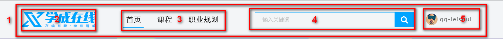

- 1号是版心盒子 **header**  1200 *  42 的盒子水平居中对齐, 上下给一个margin值就好了。
- 版心盒子 里面包含 2号盒子 **logo** 图标
- 版心盒子 里面包含 3号盒子 **nav** 导航栏
- 版心盒子 里面包含 4号盒子 **search** 搜索框
- 版心盒子 里面包含 5号盒子 **user** 个人信息
- 注意，要求里面的 **4个子盒子 必须都浮动**

**导航栏注意点:**

实际开发中，**重要的导航栏**，我们不会直接用链接a ，而是**用 li  包含链接(li+a)的做法**

​	1.li+a 语义更清晰，一看这就是有条理的列表型内容。

​	2.如果直接用a，搜索引擎容易辨别为有堆砌关键字嫌疑（故意堆砌关键字容易被搜索引擎有降权的风险），从而影响网站排名

**注意:** 

​	1.让导航栏一行显示, 给 li 加浮动, 因为 li 是块级元素, 需要一行显示.

​	2.这个nav导航栏可以不给宽度,将来可以继续添加其余文字

​	3.因为导航栏里面文字不一样多,所以最好给链接 a 左右padding 撑开盒子,而不是指定宽度 

**4号盒子search的细节：**

​	search 搜索框的意思:  一个 search 大盒子里面包含 2个 表单

​	技巧：input和button都，属于行内块元素，会有缝隙，使用浮动，可以去缝隙。


#### 3.4.2. banner制作

结构图如下：


- 1号盒子是通栏的大盒子**banner**， 不给宽度，给高度，给一个蓝色背景。
- 2号盒子是版心 **w**， 要水平居中对齐。
- 3号盒子版心内，左对齐 **subnav** 侧导航栏。
- 4号盒子版心内，右对齐  **course** 课程。

##### 3.4.2.1  subnav 侧导航栏 (左侧的)

   

- subnav 盒子 背景色 黑色半透明
- 重要的导航栏，li 包 a ，行高45px
- a里面包含文字和span，span右浮动
- 当鼠标经过a ，a里面的内容（文字和span）变蓝色

##### 3.4.2.2  course课程表模块 (右侧的)

结构图如下：

 

- 1号盒子 是  228 * 300 的盒子 右浮动  **注意 浮动的元素 不会有外边距塌陷的问题**
- 1号盒子内 分为 上下 两个 子盒子
- 2号子盒子是 上部分  我们命名为 course-hd    (hd  是  head  的简写 头部的意思，我们经常用)
- 3号子盒子是 下部分  我们命名为 course-bd    (bd  是  body  的简写 主体的意思，我们经常用)

#### 3.4.3. 精品推荐小模块

结构图如下：


- **复习点：**  因为里面三个盒子都要垂直居中，我们利用 继承性，给 最大的盒子 一个垂直居中的代码就好了，还记得 那些 样式可以继承吗？？？ font-  line-  text- color

- 大盒子水平居中 goods  精品 ，注意此处有个盒子阴影

- 1号盒子是标题 H3  左侧浮动

- 2号盒子 里面放链接  左侧浮动  goods-item    距离可以控制链接的 左右外边距（注意行内元素只给左右内外边距）

- 3号盒子 右浮动 mod 修改

#### 3.4.4. 精品推荐大模块

结构图如下：


- 1号盒子为最大的盒子 **box**  版心水平居中对齐
- 2号盒子为上面部分 **box-hd**  -- 里面   左侧标题H3 左浮动   右侧 链接 a 右浮动
- 3号盒子为底下部分 **box-bd** --- 里面是无序列表 有 10个 小li 组成
- 小li 外边距的问题， 这里有个小技巧。  给box-hd 宽度为 1215 就可以一行装开5个 li了
- 复习点：我们用到清除浮动，因为 box-hd 里面的盒子个数不一定是多少，所以我们就不给高度了，但是里面的盒子浮动会影响下面的布局，因此需要清除浮动。

#### 3.4.5.  底部模块制作

结构图如下：


- 1号盒子通栏大盒子 底部 **footer**  给高度  底色是白色

- 2号盒子版心水平居中

- 3号盒子版权 **copyright**  左对齐 

- 4号盒子 链接组 **links**  右对齐

  

# CSS定位

> **今日目标**
>
> - 能够说出 为什么要用定位
> - 能够说出 定位的 4 种分类
> - 能够说出 4 种定位各自的特点
> - 能够说出 为什么常用子绝父相布局
> - 能够写出 淘宝轮播图布局
> - 能够说出 显示隐藏的 3 种方式以及区别

## 1. 定位(position) 介绍

### 1.1 为什么使用定位

> 我们先来看一个效果，同时思考一下**用标准流或浮动能否实现类似的效果**？

**场景1**： 某个元素可以自由的在一个盒子内移动位置，并且压住其他盒子.


**场景2**：当我们滚动窗口的时候，盒子是固定屏幕某个位置的。


> 结论**：要实现以上效果，**标准流 或 浮动都无法快速实现

> 所以：
>
> 1. 浮动可以让多个块级盒子一行没有缝隙排列显示， 经常用于横向排列盒子。
>
> 2. <font color='red'>定位则是可以让盒子自由的在某个盒子内移动位置或者固定屏幕中某个位置，并且可以压住其他盒子。</font>

### 1.2 定位组成

**定位**：将盒子**定**在某一个位置，所以**定位也是在摆放盒子， 按照定位的方式移动盒子**

定位也是用来布局的，它有两部分组成：

> **定位 = 定位模式 + 边偏移**  

**定位模式** 用于指定一个元素在文档中的定位方式。**边偏移**则决定了该元素的最终位置。

#### 1.2.1 边偏移（方位名词）

<font color='red'>**边偏移** 就是定位的盒子移动到最终位置。有 top、bottom、left 和 right  4 个属性。</font>

| 边偏移属性 | 示例           | 描述                                                     |
| ---------- | :------------- | -------------------------------------------------------- |
| `top`      | `top: 80px`    | **顶端**偏移量，定义元素相对于其父元素**上边线的距离**。 |
| `bottom`   | `bottom: 80px` | **底部**偏移量，定义元素相对于其父元素**下边线的距离**。 |
| `left`     | `left: 80px`   | **左侧**偏移量，定义元素相对于其父元素**左边线的距离**。 |
| `right`    | `right: 80px`  | **右侧**偏移量，定义元素相对于其父元素**右边线的距离**   |

定位的盒子有了边偏移才有价值。 一般情况下，凡是有定位地方必定有边偏移。

#### 1.2.2 定位模式 (position)

在 CSS 中，通过 `position` 属性定义元素的**定位模式**，语法如下：

```css
选择器 { 
    position: 属性值; 
}
```

定位模式是有不同分类的，在不同情况下，我们用到不同的定位模式。

定位模式决定元素的定位方式 ，它通过 CSS 的 position 属性来设置，其值可以分为四个：

| 值         |     语义     |
| ---------- | :----------: |
| `static`   | **静态**定位 |
| `relative` | **相对**定位 |
| `absolute` | **绝对**定位 |
| `fixed`    | **固定**定位 |

 

### 1.3 定位模式介绍

#### 1.3.1.  静态定位(static) - 了解

> **静态定位**是元素的**默认**定位方式，**无定位的意思**。它相当于 border 里面的none，静态定位static，不要定位的时候用。

- 语法：

  ```
  选择器 { 
      position: static; 
  }
  ```

- 静态定位 按照标准流特性摆放位置，它没有边偏移。

- 静态定位在布局时我们几乎不用的 

#### 1.3.2. 相对定位(relative) - 重要

> <font color='red'>**相对定位**是元素在移动位置的时候，是相对于它自己**原来的位置**来说的（自恋型）。</font>

- 语法：

```
选择器 { 
	position: relative; 
}
```

> **相对定位的特点：（务必记住）**
>
> - 1.它是相对于自己原来的位置来移动的（移动位置的时候参照点是自己原来的位置）。
> - 2.**原来**在标准流的**位置**继续占有，后面的盒子仍然以标准流的方式对待它。
> - 因此，**相对定位并没有脱标**。它最典型的应用是给绝对定位当爹的。

- 效果图：


#### 1.3.3. 绝对定位(absolute) - 重要  

##### 1.3.3.1 绝对定位的介绍

> <font color='blue'>**绝对定位**是元素在移动位置的时候，是相对于它**祖先元素**来说的（拼爹型）。</font>

- 语法：

  ```
   选择器 { 
   	position: absolute; 
   }
  ```

**绝对定位的特点：（务必记住）**

1. <font color='red'>**完全脱标** —— 完全不占位置； </font>

2. **父元素没有定位**，则以**浏览器**为准定位（Document 文档）。

   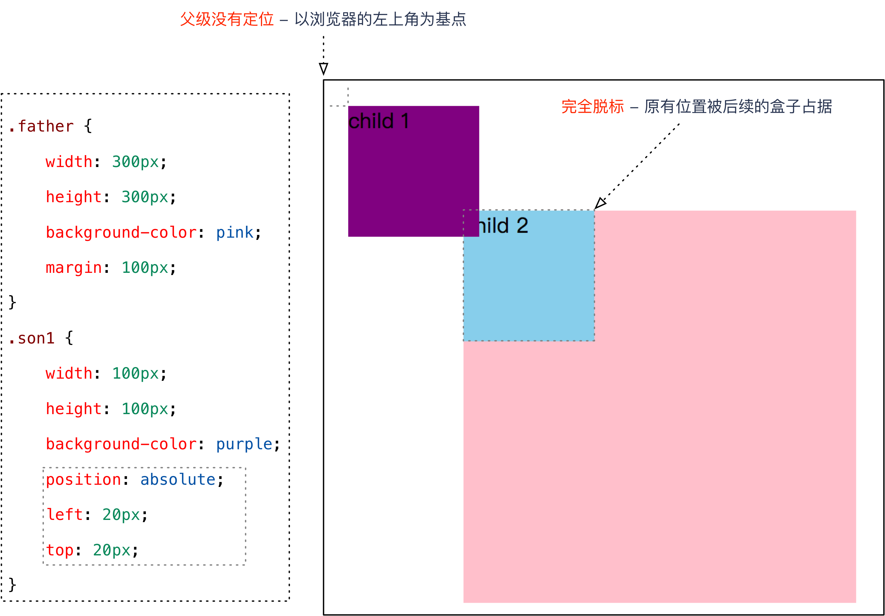

3. **父元素要有定位**

   <font color='red'> 元素将依据最近的已经定位（绝对、固定或相对定位）的父元素（祖先）进行定位。 </font>


> **绝对定位的特点总结**：（务必记住）
>
> 1. 如果**没有祖先元素**或者**祖先元素没有定位**，则以浏览器为基准定位（Document 文档）。
>
> 2. 如果祖先元素有定位（相对、绝对、固定定位），则以最近一级的有定位祖先元素为参考点移动位置。
>
> 3. <font color='red'>绝对定位**不再占有原先的位置**。所以绝对定位是脱离标准流的。（脱标）</font>

##### 1.3.3.2 定位口诀 —— 子绝父相

弄清楚这个口诀，就明白了绝对定位和相对定位的使用场景。

这个**“子绝父相”**太重要了，是我们学习定位的**口诀**，是定位中最常用的一种方式这句话的意思是：**子级是绝对定位的话，父级要用相对定位。**


> 因为绝对定位的盒子是拼爹的，所以要和父级搭配一起来使用。
>
> ①子级绝对定位，不会占有位置，可以放到父盒子里面的任何一个地方，不会影响其他的兄弟盒子。
>
> ②父盒子需要加定位限制子盒子在父盒子内显示。
>
> ③父盒子布局时，需要占有位置，因此父亲只能是相对定位。
>


这就是子绝父相的由来，所以**相对定位经常用来作为绝对定位的父级**。

总结： **因为父级需要占有位置，因此是相对定位， 子盒子不需要占有位置，则是绝对定位**

当然，子绝父相不是永远不变的，如果父元素不需要占有位置，**子绝父绝**也会遇到。


<font color='red'>**疑问**：为什么在布局时，**子级元素**使用**绝对定位**时，**父级元素**就要用**相对定位**呢？</font>

观察下图，思考一下在布局时，**左右两个方向的箭头图片**以及**父级盒子**的定位方式。


**分析**：

> 1. **方向箭头**叠加在其他图片上方，应该使用**绝对定位**，因为**绝对定位完全脱标**，完全不占位置。
> 2. **父级盒子**应该使用**相对定位**，因为**相对定位不脱标**，后续盒子仍然以标准流的方式对待它。
>    - 如果父级盒子也使用**绝对定位**，会完全脱标，那么下方的**广告盒子**会上移，这显然不是我们想要的。
>

**结论**：**父级要占有位置，子级要任意摆放**，这就是**子绝父相**的由来。


#### 1.3.4. 固定定位(fixed) - 重要

> <font color='red'>**固定定位**是元素**固定于浏览器可视区的位置**。</font>（认死理型）   
>
> <font color='orange'>主要使用场景： 可以在浏览器页面滚动时元素的位置不会改变。</font>

- 语法：

  ```
   选择器 { 
   	position: fixed; 
   }
  ```

  **固定定位的特点：（务必记住）：**

  > 1. 以浏览器的可视窗口为参照点移动元素。
  >
  > - 跟父元素没有任何关系
  > - <font color='red'> 不随滚动条滚动。 </font>
  >
  > 2. <font color='red'>固定定位**不在占有原先的位置**。</font>

- 固定定位也是**脱标**的，其实**固定定位也可以看做是一种特殊的绝对定位**。（认死理型） 

  - **完全脱标**—— 完全不占位置；
  - 只认**浏览器的可视窗口** —— `浏览器可视窗口 + 边偏移属性` 来设置元素的位置；
    - 跟父元素没有任何关系；单独使用的
    - 不随滚动条滚动。

> 固定定位举例：


**提示**：IE 6 等低版本浏览器不支持固定定位。

**固定定位小技巧：<font color='red'>固定在版心右侧位置。</font>**

> 小算法：
> 1. 让固定定位的盒子 left: 50%. 走到浏览器可视区（也可以看做版心） 的一半位置。
> 2. 让固定定位的盒子 margin-left: 版心宽度的一半距离。 多走 版心宽度的一半位置
> 就可以让固定定位的盒子贴着版心右侧对齐了。

#### 1.3.5 粘性定位(sticky) - 了解

> **粘性定位**可以被认为是相对定位和固定定位的混合。 Sticky  粘性的 

- 语法：

  ```
   选择器 { 
       position: sticky; 
       top: 10px; 
   }
  
  ```

  > 粘性定位的特点：
  >
  > 1. 以浏览器的可视窗口为参照点移动元素（固定定位特点）
  >
  > 2. **粘性定位占有原先的位置（相对定位特点）**
  >
  > 3. <font color='hotpink'>必须添加 top 、left、right、bottom **其中一个**才有效</font>
  >
  > 跟页面滚动搭配使用。 兼容性较差，IE 不支持。
  >


#### 1.3.6 定位总结

| **定位模式**          | **是否脱标**         | **移动位置**           | **是否常用**                 |
| --------------------- | -------------------- | ---------------------- | ---------------------------- |
| static   静态定位     | 否                   | 不能使用边偏移         | 很少                         |
| **relative 相对定位** | **否 (占有位置)**    | **相对于自身位置移动** | **基本单独使用**             |
| **absolute绝对定位**  | **是（不占有位置）** | **带有定位的父级**     | **要和定位父级元素搭配使用** |
| **fixed 固定定位**    | **是（不占有位置）** | **浏览器可视区**       | **单独使用，不需要父级**     |
| sticky 粘性定位       | 否   (占有位置)      | 浏览器可视区           | 当前阶段少                   |

- 一定记住 相对定位、固定定位、绝对定位 两个大的特点： 1. 是否占有位置（脱标否） 2. 以谁为基准点移动位置。

- **学习定位重点学会子绝父相。**
- 注意：

1. **边偏移**需要和**定位模式**联合使用，**单独使用无效**；
2. `top` 和 `bottom` 不要同时使用；
3. `left` 和 `right` 不要同时使用。

## 2. 综合案例：学成在线-hot  模块添加

### **2. 1 案例截图**：

 

### 2.2 案例分析

1. 一个大的 `li` 中包含 一个课程图片，课程介绍文字信息，还有hot的小图标；
2. hot图片**重叠**在课程图片上面—— 脱标，不占位置，需要使用**绝对定位**；
3. hot图片**重叠**在**li的右上方 —— 需要**使用边偏移确定准确位置。

### 2.3 案例小结

1. **子绝父相** —— **子元素**使用**绝对定位**，**父元素**使用**相对定位**；
2. **与浮动的对比**：
   * **绝对定位**：脱标，**利用边偏移指定准确位置**；
   * **浮动**：脱标，不能指定准确位置，**让多个块级元素在一行显示**。

> 课堂练习：模拟老师的随堂案例完成**哈根达斯**案例（5 分钟）。

结构修改：

```html
<!-- 修改.box-bd里面的li标签内容，添加一个hot图标 -->

<li>
	 <!-- 添加hot小图片 -->
    <em>
        
    </em>
    
    <h4>
        Think PHP 5.0 博客系统实战项目演练
    </h4>
    <div class="info">
        <span>高级</span> • 1125人在学习
    </div>
</li>
```

样式修改：

```css
.box-bd ul li {
    /* 子绝父相 */
    /* 父元素相对定位 */
    position: relative;
    float: left;
    width: 228px;
    height: 270px;
    background-color: #fff;
    margin-right: 15px;
    margin-bottom: 15px;
   
}
.box-bd ul li > img {
    width: 100%;
}
.box-bd ul li h4 {
    margin: 20px 20px 20px 25px;
    font-size: 14px;
    color: #050505;
    font-weight: 400;
}
.box-bd ul li em {
     /* 子元素绝对定位 */
    position: absolute;
    top: 4px;
    right: -4px;
}
```

## 3. 定位(position)的应用

### 3.1.  固定定位小技巧： 固定在版心左侧位置。

小算法：

1.让固定定位的盒子 left: 50%.  走到浏览器可视区（也可以看做版心） 的一半位置。

2.让固定定位的盒子 margin-left: 版心宽度的一半距离。  多走 版心宽度的一半位置

就可以让固定定位的盒子**贴着版心右侧对齐**了。


案例效果：

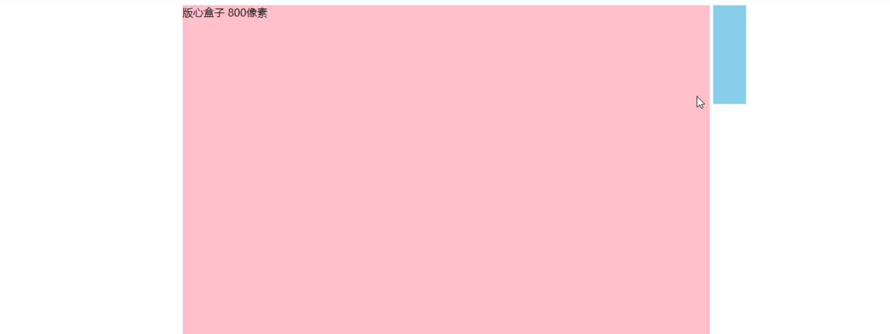

```html
<style>
        .w {
            width: 800px;
            height: 1400px;
            background-color: pink;
            margin: 0 auto;
        }
        .fixed {
            position: fixed;
            /* 1. 走浏览器宽度的一半 */
            left: 50%;
            /* 2. 利用margin 走版心盒子宽度的一半距离 */
            margin-left: 405px;
            width: 50px;
            height: 150px;
            background-color: skyblue;
        }
    </style>
</head>
<body>
    <div class="fixed"></div>
    <div class="w">版心盒子 800像素</div>
  
</body>

```


### 3.2. 堆叠顺序（z-index）

> 在使用**定位**布局时，可能会**出现盒子重叠的情况**。此时，<font color='red'>可以使用 **z-index** 来控制盒子的前后次序 (z轴)</font>

- 语法：

  ```
  选择器 { 
  	z-index: 1; 
  }
  ```

- `z-index` 的特性如下：

  > 1. **属性值**：**正整数**、**负整数**或 **0**，默认值是 0，数值越大，盒子越靠上；	
  > 2. 如果**属性值相同**，则按照书写顺序，**后来居上**；
  > 3. 数字后面**不能加单位**。
  > 4. 只有定位的盒子才有z-index属性
  >

  **注意**：`z-index` 只能应用于**相对定位**、**绝对定位**和**固定定位**的元素，其他**标准流**、**浮动**和**静态定位**无效。

- 应用 `z-index` 层叠等级属性可以**调整盒子的堆叠顺序**。如下图所示：


> 案例演示：堆叠顺序。
>


## 4. 定位(position)的拓展

### 4.1 绝对定位的盒子居中

> <font color='blue'>**注意**：加了**绝对定位/固定定位的盒子**不能通过设置 `margin: auto` 设置**水平居中**。</font>
>
> 但是可以通过以下计算方法实现水平和垂直居中，可以按照下图的方法：


1. `left: 50%;`：让**盒子的左侧**移动到**父级元素的水平中心位置**；
2. `margin-left: -100px;`：让盒子**向左**移动**自身宽度的一半**。

**盒子居中定位示意图**


### 4.2 定位特殊特性

> 绝对定位和固定定位也和浮动类似。
>
> 1. <font color='red'> 行内元素添加绝对或者固定定位，可以直接设置高度和宽度。 </font>
>
> 2. <font color='green'>块级元素添加绝对或者固定定位，如果不给宽度或者高度，默认大小是内容的大小。</font>

前面我们讲过， display 是显示模式， 可以改变显示模式有以下方式:

- 可以用inline-block  转换为行内块
- 可以用浮动 float 默认转换为行内块（类似，并不完全一样，因为浮动是脱标的）
- 绝对定位和固定定位也和浮动类似， 默认转换的特性 转换为行内块。

所以说， <font color='orange'>一个行内的盒子，如果加了**浮动**、**固定定位**和**绝对定位**，不用转换，就可以给这个盒子直接设置宽度和高度等。</font>

### 4.3 脱标的盒子不会触发外边距塌陷

浮动元素、**绝对定位(固定定位）**元素的都不会触发外边距合并的问题。 （我们以前是用padding border overflow解决的）

也就是说，我们给盒子改为了浮动或者定位，就不会有垂直**外边距合并的问题**了。


### 4.4 绝对定位（固定定位）会完全压住盒子

浮动元素不同，只会压住它下面标准流的盒子，但是不会压住下面标准流盒子里面的文字（图片）

<font color='red'>但是绝对定位（固定定位） 会压住下面标准流所有的内容。</font>

浮动之所以不会压住文字，因为浮动产生的目的最初是为了做文字环绕效果的。 文字会围绕浮动元素


## 5. 综合案例 - 淘宝轮播图(重点)

### 5.1 效果图


### 5.2 布局分析


### 5.3 步骤

1. 大盒子我们类名为：  tb-promo      淘宝广告

2. 里面先放一张图片。

3. 左右两个按钮 用链接就好了。   左箭头 prev    右箭头  next   

   ​	左按钮样式（border-radius：左上，右上，右下，左下），

   ​	右按钮定位，提取左右按钮共同的样式代码（并集选择器）

4. 底侧小圆点ul 继续做。 类名为 promo-nav     

   ​	中间长方形椭圆 ul的定位（水平居中，离底部15px）  

   ​	长方形需要五个小圆点，ul无序列表，li浮动，椭圆中小圆点的样式


### 5.4 知识点：圆角矩形设置4个角

圆角矩形可以为4个角分别设置圆度， 但是是有顺序的

```
border-top-left-radius:20px;
border-top-right-radius:20px;
border-bottom-right-radius:20px;
border-bottom-left-radius:20px;
```

* 如果4个角，数值相同

  ~~~css
  border-radius: 15px;
  ~~~

* 里面数值不同，我们也可以按照简写的形式，具体格式如下:

~~~css
border-radius: 左上角 右上角  右下角  左下角;
~~~

还是遵循的顺时针。

### 5.5 代码参考

```html
<!DOCTYPE html>
<html lang="en">

<head>
    <meta charset="UTF-8">
    <meta name="viewport" content="width=device-width, initial-scale=1.0">
    <meta http-equiv="X-UA-Compatible" content="ie=edge">
    <title>淘宝轮播图做法</title>
    <style>
        * {
            margin: 0;
            padding: 0;
        }
        li {
            list-style: none;
        }

        .tb-promo {
            position: relative;
            width: 520px;
            height: 280px;
            background-color: pink;
            margin: 100px auto;
        }

        .tb-promo img {
            width: 520px;
            height: 280px;
        }

        /* 并集选择器可以集体声明相同的样式 */
        .prev,
        .next {
            position: absolute;
            /* 绝对定位的盒子垂直居中 */
            top: 50%;
            margin-top: -15px;
            /* 加了绝对定位的盒子可以直接设置高度和宽度 */
            width: 20px;
            height: 30px;
            background: rgba(0, 0, 0, .3);
            text-align: center;
            line-height: 30px;
            color: #fff;
            text-decoration: none;
        }

        .prev {
            left: 0;
            /* border-radius: 15px; */
            border-top-right-radius: 15px;
            border-bottom-right-radius: 15px;
        }

        .next {
            /* 如果一个盒子既有left属性也有right属性，则默认会执行 left属性 同理  top  bottom  会执行 top */
            right: 0;
            /* border-radius: 15px; */
            border-top-left-radius: 15px;
            border-bottom-left-radius: 15px;
        }
        .promo-nav {
            position: absolute;
            bottom: 15px;
            left: 50%;
            margin-left: -35px;
            width: 70px;
            height: 13px;
            /* background-color: pink; */
            background: rgba(255,255,255, .3);
            border-radius: 7px;
        }
        .promo-nav li {
            float: left;
            width: 8px;
            height: 8px;
            background-color: #fff;
            border-radius: 50%;
            margin: 3px;
        }
        /* 不要忘记选择器权重的问题 */
       .promo-nav .selected {
            background-color: #ff5000;
        }
    </style>
</head>

<body>
    <div class="tb-promo">
        
        <!-- 左侧按钮箭头 -->
        <a href="#" class="prev"> &lt; </a>
        <!-- 右侧按钮箭头 -->
        <a href="#" class="next"> &gt; </a>
        <!-- 小圆点 -->
        <ul class="promo-nav">
            <li class="selected"></li>
            <li></li>
            <li></li>
            <li></li>
            <li></li>
        </ul>
    </div>
</body>

</html>

```

## 6. 网页布局总结

通过盒子模型，清楚知道大部分html标签是一个盒子。

通过CSS浮动、定位 可以让每个盒子排列成为网页。

一个完整的网页，是标准流、浮动、定位一起完成布局的，每个都有自己的专门用法。

### 6.1. 标准流 

<font color='red'>可以让盒子上下排列或者左右排列，</font>**垂直的块级盒子显示就用标准流布局**。

### 6.2. 浮动

<font color='red'>可以让多个块级元素一行显示或者左右对齐盒子，</font>**多个块级盒子水平显示就用浮动布局**

### 6.3. 定位

定位最大的特点是有层叠的概念，就是可以让多个盒子前后叠压来显示。**如果元素自由在某个盒子内移动就用定位布局。**

## 7. 元素的显示与隐藏

- 目的（本质）

  ​	<font color='green'>让一个元素在页面中消失或者显示出来</font>

- 场景

  ​	类似网站广告，当我们点击关闭就不见了，但是我们重新刷新页面，会重新出现！

> 1. display 显示隐藏
> 2. visibility 显示隐藏
> 3. overflow 溢出显示隐藏

### 7.1. display 显示（重点）

- <font color='blue'>display 设置或检索对象是否及如何显示。</font>

  ```
  display: none 隐藏对象
  
  display：block 除了转换为块级元素之外，同时还有显示元素的意思。
  ```

- <font color='blue'>特点： display 隐藏元素后，**不再占**有原来的位置。</font>

- 后面应用及其广泛，搭配 JS 可以做很多的网页特效。实际开发场景：

  > 配合后面js做特效，比如下拉菜单，原先没有，鼠标经过，显示下拉菜单， 应用极为广泛


### 7.2. visibility 可见性 （了解）

- <font color='green'>visibility 属性用于指定一个元素应可见还是隐藏。</font>

  ```
  visibility：visible ; 　元素可视
  
  visibility：hidden; 　  元素隐藏
  ```

- <font color='green'>特点：**visibility 隐藏元素后，继续占有原来的位置**。（停职留薪）</font>

- 如果隐藏元素想要原来位置， 就用 visibility：hidden

- 如果隐藏元素不想要原来位置， 就用 display：none  (用处更多 重点）


### 7.3. overflow 溢出（重点）

- <font color='orange'>overflow 属性指定了如果内容溢出一个元素的框（超过其指定高度及宽度） 时，会发生什么。</font>

| 属性值      | 描述                                       |
| ----------- | ------------------------------------------ |
| **visible** | 不剪切内容也不添加滚动条                   |
| **hidden**  | 不显示超过对象尺寸的内容，超出的部分隐藏掉 |
| **scroll**  | 不管超出内容否，总是显示滚动条             |
| **auto**    | 超出自动显示滚动条，不超出不显示滚动条     |

-  一般情况下，我们都不想让溢出的内容显示出来，因为溢出的部分会影响布局。
-  但是如果有定位的盒子， 请慎用overflow:hidden  因为它会隐藏多余的部分。


- 实际开发场景：

> 1. 清除浮动
> 2. 隐藏超出内容，隐藏掉,  不允许内容超过父盒子。
>

### 7.4. 显示与隐藏总结

| 属性                           | 区别                   | 用途                                                         |
| ------------------------------ | ---------------------- | ------------------------------------------------------------ |
| **display 显示     （重点）**  | 隐藏对象，不保留位置   | 配合后面js做特效，比如下拉菜单，原先没有，鼠标经过，显示下拉菜单， 应用极为广泛 |
| **visibility 可见性 （了解）** | 隐藏对象，保留位置     | 使用较少                                                     |
| **overflow 溢出（重点）**      | 只是隐藏超出大小的部分 | 1. 可以清除浮动  2. 保证盒子里面的内容不会超出该盒子范围     |

## 8 综合案例：土豆网鼠标经过显示遮罩

### 8.1. 效果图


### 8.2. 案例目标

1.练习元素的显示与隐藏

2.练习元素的定位

### 8.3. 核心原理

原先半透明的黑色遮罩看不见， 鼠标经过 大盒子，就显示出来。

遮罩的盒子不占有位置， 就需要用绝对定位 和 display  配合使用。

### 8.4. 代码参考

```html
<!DOCTYPE html>
<html lang="en">

<head>
    <meta charset="UTF-8">
    <meta name="viewport" content="width=device-width, initial-scale=1.0">
    <meta http-equiv="X-UA-Compatible" content="ie=edge">
    <title>仿土豆网显示隐藏遮罩案例</title>
    <style>
        .tudou {
            position: relative;
            width: 444px;
            height: 320px;
            background-color: pink;
            margin: 30px auto;
        }

        .tudou img {
            width: 100%;
            height: 100%;
        }

        .mask {
            /* 隐藏遮罩层 */
            display: none;
            position: absolute;
            top: 0;
            left: 0;
            width: 100%;
            height: 100%;
            background: rgba(0, 0, 0, .4) url(images/arr.png) no-repeat center;
        }

        /* 当我们鼠标经过了 土豆这个盒子，就让里面遮罩层显示出来 */
        .tudou:hover .mask {
            /* 而是显示元素 */
            display: block;
        }
    </style>
</head>

<body>
    <div class="tudou">
        <div class="mask"></div>
        
    </div>
    <div class="tudou">
        <div class="mask"></div>
        
    </div>
    <div class="tudou">
        <div class="mask"></div>
        
    </div>
    <div class="tudou">
        <div class="mask"></div>
        
    </div>
</body>
</html>
```

> 学习目标：
>
> ​	能够使用精灵图
>
> ​	能够使用字体图标
>
> ​	能够写出 CSS 三角
>
> ​	能够写出常见的 CSS 用户界面样式
>
> ​	能够说出常见的布局技巧


## 1. 精灵图（重点）

### 1.1 为什么需要精灵图


一个网页中往往会应用很多小的背景图像作为修饰，当网页中的图像过多时，服务器就会频繁地接收和发送请求图片，造成服务器请求压力过大，这将大大降低页面的加载速度。

**为什么使用精灵图（目的）：**

> **<font color='red'>为了有效地减少服务器接收和发送请求的次数</font>**，**<font color='red'>提高</font>**页面的**加载速度**，出现了 **CSS 精灵技术**（也称 CSS Sprites、CSS 雪碧）。

**核心原理**：

​	<font color='red'>将网页中的一些小背景图像整合到一张大图中 ，这样服务器只需要一次请求就可以了。</font>

**精灵图举例**:


### 1.2 精灵图（sprites）的使用

使用精灵图核心：

> 1. <font color='green'>精灵技术主要针对于背景图片使用。就是把多个小背景图片整合到一张大图片中。</font>
> 2. 这个大图片也称为 sprites  精灵图  或者 雪碧图
> 3. <font color='blue'>移动背景图片位置， 此时可以使用 background-position 。</font>
> 4. 移动的距离就是这个目标图片的 x 和 y 坐标。注意网页中的坐标有所不同
> 5. <font color='green'>因为一般情况下都是往上往左移动，所以数值是负值。</font>
> 6. 使用精灵图的时候需要精确测量，每个小背景图片的大小和位置。

使用精灵图核心总结：

> 1. 精灵图主要**针对于小的背景图片**使用。
>
> 2. 主要借助于背景位置来实现---**background-position** 。
>
> 3. 一般情况下精灵图都是**负值**。（千万注意网页中的坐标： x轴右边走是正值，左边走是负值， y轴同理。）

### 1.3 案例：拼出自己名字

#### 1.3.1 案例效果


#### 1.3.2 代码参考

结构

```html
<span class="p">p</span>
<span class="i">i</span>
<span class="n">n</span>
<span class="k">k</span>
```

样式

```css
span {
    display: inline-block;
    background: url(images/abcd.jpg) no-repeat;
}
.p {
    width: 100px;
    height: 112px;
    /* background-color: pink; */
    background-position:  -493px -276px;
}
.i {
    width: 60px;
    height: 108px;
    /* background-color: pink; */
    background-position: -327px -142px;
}
.n {
    width: 108px;
    height: 109px;
    /* background-color: pink; */
    background-position: -215px -141px;
}
.k {
    width: 105px;
    height: 114px;
    /* background-color: pink; */
    background-position: -495px -142px;
}
```

## 2. 字体图标

### 2.1 字体图标的产生

字体图标使用场景：  主要用于显示网页中通用、常用的一些小图标。

精灵图是有诸多优点的，但是缺点很明显。

> 1. 图片文件还是比较大的。
>
> 2. 图片本身放大和缩小会失真。
>
> 3. 一旦图片制作完毕想要更换非常复杂。

此时，有一种技术的出现很好的解决了以上问题，就是**字体图标 iconfont**。

> **字体图标**可以为前端工程师提供一种方便高效的图标使用方式，**<font color='red'>展示的是图标，本质属于字体</font>**。

### 2.2 字体图标的优点

**轻量级**：一个图标字体要比一系列的图像要小。<font color='red'>一旦字体加载了，图标就会马上渲染出来，减少了服务器请求</font>

> - 灵活性：本质其实是文字，可以很随意的改变颜色、产生阴影、透明效果、旋转等
> - 兼容性：几乎支持所有的浏览器，请放心使用
> - 注意： 字体图标不能替代精灵技术，只是对工作中图标部分技术的提升和优化。

**总结：**

1.如果遇到一些结构和样式比较简单的小图标，就用字体图标。

2.如果遇到一些结构和样式复杂一点的小图片，就用精灵图。


**使用步骤**

字体图标是一些网页常见的小图标，我们直接网上下载即可。 因此使用可以分为：

> 1. 字体图标的下载 
>
> 2. 字体图标的引入 （引入到我们html页面中）
>
> 3. 字体图标的追加 （以后添加新的小图标）

### **2.3** **字体图标的下载**

**推荐下载网站：**

- **icomoon** **字库**  http://icomoon.io    推荐指数  **★★★★★**

> IcoMoon 成立于 2011 年，推出了第一个自定义图标字体生成器，它允许用户选择所需要的图标，使它们成一字型。该字库内容种类繁多，非常全面，唯一的遗憾是国外服务器，打开网速较慢。

- **阿里** **iconfont** **字库**   http://www.iconfont.cn/   推荐指数   **★★★★★** 

> 这个是阿里妈妈 M2UX 的一个 iconfont 字体图标字库，包含了淘宝图标库和阿里妈妈图标库。可以使用 AI制作图标上传生成。 重点是，免费！

### **2.4** **字体图标的引入**

**下载完毕之后，注意原先的文件不要删，后面会用**。

1. 把下载包里面的 **fonts** 文件夹放入页面根目录下


* **字体文件格式**

不同浏览器所支持的字体格式是不一样的，字体图标之所以兼容，就是因为包含了主流浏览器支持的字体文件。

> 1).TureType(  **.ttf**  )格式.ttf字体是Windows和Mac的最常见的字体，支持这种字体的浏览器有IE9+、Firefox3.5+、Chrome4+、Safari3+、Opera10+、iOS Mobile、Safari4.2+；
>
> 2).Web Open Font Format( **.woff** )格式woff字体，支持这种字体的浏览器有IE9+、Firefox3.5+、Chrome6+、Safari3.6+、Opera11.1+；
>
> 3).Embedded Open Type( **.eot** )格式.eot字体是IE专用字体，支持这种字体的浏览器有IE4+；
>
> 4).SVG(  .**svg**  )格式.svg字体是基于SVG字体渲染的一种格式，支持这种字体的浏览器有Chrome4+、Safari3.1+、Opera10.0+、iOS Mobile Safari3.2+；

2.在 CSS 样式中全局声明字体： 简单理解把这些字体文件通过css引入到我们页面中。

一定注意字体文件路径的问题

```
 @font-face {
   font-family: 'icomoon';
   src:  url('fonts/icomoon.eot?7kkyc2');
   src:  url('fonts/icomoon.eot?7kkyc2#iefix') format('embedded-opentype'),
     url('fonts/icomoon.ttf?7kkyc2') format('truetype'),
     url('fonts/icomoon.woff?7kkyc2') format('woff'),
     url('fonts/icomoon.svg?7kkyc2#icomoon') format('svg');
   font-weight: normal;
   font-style: normal;
 }
```


3. html 标签内添加小图标。


4. 给标签定义字体。

   ```
    span {
      font-family: "icomoon";
    }
   ```

   注意：务必保证 这个字体和上面@font-face里面的字体保持一致 

   

### 2.5 字体图标的追加

如果工作中，原来的字体图标不够用了，我们需要添加新的字体图标到原来的字体文件中。

把压缩包里面的 **selection.json** 从新上传，然后选中自己想要新的图标，从新下载压缩包，并替换原来的文件即可。


### 2.6 字体图标加载的原理：


## 3. CSS 三角

### 3.1 介绍

网页中常见一些三角形，使用 CSS 直接画出来就可以，不必做成图片或者字体图标。

一张图， 你就知道 CSS 三角是怎么来的了, 做法如下：


```css
 div {
 	width: 0; 
    height: 0;
    border: 50px solid transparent;
	border-color: red green blue black;
	line-height:0;
    font-size: 0;
 }
```

> 1. 我们用css 边框可以模拟三角效果
> 2. 宽度高度为0
> 3. 我们4个边框都要写， 只保留需要的边框颜色，其余的不能省略，都改为 transparent 透明就好了
> 4. 为了照顾兼容性 低版本的浏览器，加上 font-size: 0;  line-height: 0;

### 3.2 案例：京东三角

#### 3.2.1效果图


#### 3.2.2 代码参考

```html
<!DOCTYPE html>
<html lang="en">
<head>
    <meta charset="UTF-8">
    <meta name="viewport" content="width=device-width, initial-scale=1.0">
    <meta http-equiv="X-UA-Compatible" content="ie=edge">
    <title>CSS 三角制作</title>
    <style>
        .box1 {
            width: 0;
            height: 0;
            /* border: 10px solid pink; */
            border-top: 10px solid pink;
            border-right: 10px solid red;
            border-bottom: 10px solid blue;
            border-left: 10px solid green;
        }
        .box2 {
            width: 0;
            height: 0;
            border: 50px solid transparent;
            border-left-color: pink;
            margin: 100px auto;
        }
        .jd {
            position: relative;
            width: 120px;
            height: 249px;
            background-color: pink;
        }
        .jd span {
            position: absolute;
            right: 15px;
            top: -10px;
            width: 0;
            height: 0;
            /* 为了照顾兼容性 */
            line-height: 0;  
            font-size: 0;
            border: 5px solid transparent;
            border-bottom-color: pink;
        }
    </style>
</head>
<body>
    <div class="box1"></div>
    <div class="box2"></div>
    <div class="jd">
        <span></span>
    </div>
</body>
</html>
```

## 4. CSS 用户界面样式

**什么是界面样式**

> <font color='red'>所谓的界面样式，就是更改一些用户操作样式，以便提高更好的用户体验。</font>
>
> - 更改用户的鼠标样式 
> - 表单轮廓
> - 防止表单域拖拽

### 4.1 鼠标样式 cursor

```css
 li {
 	cursor: pointer; 
 }
```

<font color='blue'>设置或检索在对象上移动的鼠标指针采用何种系统预定义的光标形状。</font>


### 4.2 轮廓线 outline

<font color='green'>给表单添加 outline: 0;   或者  outline: none; 样式之后，就可以去掉默认的蓝色边框。</font>

```css
 input {
 	outline: none; 
 }
```

### 4.3 防止拖拽文本域 resize

 实际开发中，<font color='orange'>我们文本域右下角是不可以拖拽的。</font>

```css
 textarea{ 
 	resize: none;
 }

```

## 5. vertical-align 属性应用

> CSS 的 **vertical-align** 属性使用场景： **<font color='red'>经常用于设置图片或者表单(行内块元素）和文字垂直对齐。</font>**
>
> 官方解释： 用于设置一个元素的**垂直对齐方式**，但是<font color='green'>它只针对于行内元素或者行内块元素有效。</font>

语法：

```css
vertical-align : baseline | top | middle | bottom 
```


### **5.1** **图片、表单和文字对齐**

> 图片、表单都属于行内块元素，默认的 vertical-align 是基线对齐。


此时可以给图片、表单这些行内块元素的 **vertical-align 属性设置为 middle** 就可以让文字和图片垂直居中对齐了。

### 5.2 解决图片底部默认空白缝隙问题

<font color='red'>bug：图片底侧会有一个空白缝隙，原因是行内块元素会和文字的基线对齐。</font>

主要解决方法有两种：

1.**给图片**添加 **vertical-align:middle | top| bottom** 等。 （提倡使用的）

2.把图片转换为块级元素  **display: block**; 


## 6. 溢出的文字省略号显示

### 6.1 单行文本溢出显示省略号


单行文本溢出显示省略号--必须满足三个条件：

```css
  /*1. 先强制一行内显示文本*/
   white-space: nowrap;  （ 默认 normal 自动换行）
   
  /*2. 超出的部分隐藏*/
   overflow: hidden;
   
  /*3. 文字用省略号替代超出的部分*/
   text-overflow: ellipsis;
```

### 6.2 多行文本溢出显示省略号（了解）


多行文本溢出显示省略号，**有较大兼容性问题**，适合于webKit浏览器或移动端（移动端大部分是webkit内核）

```css
/*1. 超出的部分隐藏 */
overflow: hidden;

/*2. 文字用省略号替代超出的部分 */
text-overflow: ellipsis;

/* 3. 弹性伸缩盒子模型显示 */
display: -webkit-box;

/* 4. 限制在一个块元素显示的文本的行数 */
-webkit-line-clamp: 2;

/* 5. 设置或检索伸缩盒对象的子元素的排列方式 */
-webkit-box-orient: vertical;
```

**更推荐让后台人员来做这个效果，因为后台人员可以设置显示多少个字，操作更简单。**

## 7. 常见布局技巧

**巧妙利用一个技术更快更好的布局：**

> 1. margin负值的运用
> 2. 文字围绕浮动元素
> 3. 行内块的巧妙运用
> 4. CSS三角强化

### 7.1. margin负值运用


> 1. <font color='red'>让每个盒子margin 往左侧移动 -1px 正好压住相邻盒子边框</font>
>
> 2. <font color='blue'>鼠标经过某个盒子的时候，提高当前盒子的层级即可（如果没有有定位，则加相对定位（保留位置），如果有定位，则加z-index）</font>

### 7.2 文字围绕浮动元素

**效果**


**布局示意图**


**巧妙运用浮动元素不会压住文字的特性**

### 7.3 行内块巧妙运用


> 页码在页面中间显示:
>
> 1. 把这些链接盒子转换为行内块， 之后给父级指定  text-align:center;
> 2. 利用行内块元素中间有缝隙，并且给父级添加 text-align:center; 行内块元素会水平会居中


### 7.4. CSS 三角强化 案例

#### **7.4.1 原理**


```html
<style>
    .box1 {
        width: 0;
        height: 0;
        
        /* 把上边框宽度调大 */
        /* border-top: 100px solid transparent;
        border-right: 50px solid skyblue; */
        /* 左边和下边的边框宽度设置为0 */
        /* border-bottom: 0 solid blue;
        border-left: 0 solid green; */
        
        /* 1.只保留右边的边框有颜色 */
        border-color: transparent red transparent transparent;
        /* 2. 样式都是solid */
        border-style: solid;
        /* 3. 上边框宽度要大， 右边框 宽度稍小， 其余的边框该为 0 */
        border-width: 100px 50px 0 0 ;
    }

</style>
</head>
<body>
    <div class="box1"></div>
</body>

```

#### 7.4.2 案例效果


#### **7.4.3 代码参考**

```html
<!DOCTYPE html>
<html lang="en">
    <head>
        <meta charset="UTF-8">
        <meta name="viewport" content="width=device-width, initial-scale=1.0">
        <meta http-equiv="X-UA-Compatible" content="ie=edge">
        <title>CSS三角强化的巧妙运用</title>
        <style>
            .price {
                width: 160px;
                height: 24px;
                line-height: 24px;
                border: 1px solid red;
                margin: 0 auto;
            }
            .miaosha {
                position: relative;
                float: left;
                width: 90px;
                height: 100%;
                background-color:red;
                text-align: center;
                color: #fff;
                font-weight: 700;
                margin-right: 8px;

            }
            .miaosha i {
                position: absolute;
                right: 0;
                top: 0;
                width: 0;
                height: 0;
                border-color: transparent #fff transparent transparent;
                border-style: solid;
                border-width: 24px 10px 0 0;
            }
            .origin {
                font-size: 12px;
                color: gray;
                text-decoration: line-through;
            }
        </style>
    </head>
    <body>
        <div class="price">
            <span class="miaosha">
                ¥1650
                <i></i>
            </span>
            <span class="origin">¥5650</span>
        </div>
    </body>
</html>

```

## 8. CSS 初始化

不同浏览器对有些标签的默认值是不同的，为了消除不同浏览器对HTML文本呈现的差异，照顾浏览器的兼容，我们需要对CSS 初始化

> 简单理解： CSS初始化是指重设浏览器的样式。 (也称为CSS reset）
>
> 每个网页都必须首先进行 CSS初始化。

这里我们以 京东CSS初始化代码为例。

**Unicode编码字体：**

把中文字体的名称用相应的Unicode编码来代替，这样就可以有效的避免浏览器解释CSS代码时候出现乱码的问题。

比如：

黑体 \9ED1\4F53
宋体 \5B8B\4F53
微软雅黑 \5FAE\8F6F\96C5\9ED1

# 目标

- 能够说出 3~5 个 HTML5 新增布局和表单标签
- 能够说出 CSS3 的新增特性有哪些

# HTML5新特性

## 概述

HTML5 的新增特性主要是针对于以前的不足，增加了一些新的标签、新的表单和新的表单属性等。 

这些新特性都有兼容性问题，基本是 **IE9+ 以上版本的浏览器**才支持，如果不考虑兼容性问题，可以大量使用这些新特性。

## 语义化标签 （★★）

以前布局，我们基本用 div 来做。div 对于搜索引擎来说，是没有语义的

```html
<div class=“header”> </div>
<div class=“nav”> </div>
<div class=“content”> </div>
<div class=“footer”> </div>
```

发展到了HTML5后，新增了一些语义化标签，这样的话更加有利于浏览器的搜索引擎搜索，也方便了网站的seo（Search Engine Optimization，搜索引擎优化），下面就是新增的一些语义化标签：

- `<header>` 头部标签
- `<nav>` 导航标签
- `<article>` 内容标签
- `<section>` 定义文档某个区域
- `<aside>` 侧边栏标签
- `<footer>` 尾部标签


> 注意：
>
> - 这种语义化标准主要是针对搜索引擎的
> - 这些新标签页面中可以使用多次
> - **在 IE9 中，需要把这些元素转换为块级元素**

## 多媒体标签

> 多媒体标签分为 音频 **audio** 和视频 **video** 两个标签 使用它们，我们可以很方便的在页面中嵌入音频和视频，而不再去使用落后的flash和其他浏览器插件了。

> 因为多媒体标签的 属性、方法、事件比较多，因此我们需要什么功能的时候，就需要去查找相关的文档进行学习使用。


### 视频标签- video（★★★）

#### 基本使用

当前 **<video>** 元素支持三种视频格式： 尽量使用 **mp4格式**

**使用语法：**

```html
 <video src="media/mi.mp4"></video>
```


#### 兼容写法

由于各个浏览器的支持情况不同，所以我们会有一种兼容性的写法，这种写法了解一下即可


**上面这种写法，浏览器会匹配video标签中的source，如果支持就播放，如果不支持往下匹配，直到没有匹配的格式，就提示文本**

#### video 常用属性


**属性很多，有一些属性需要大家重点掌握：**

> - `autoplay`  自动播放
>   - 注意： 在google浏览器上面，默认禁止了自动播放，如果想要自动播放的效果，需要设置 muted属性
> - `width`  宽度
> - `height`  高度
> - `loop`  循环播放
> - `src`  播放源
> - `muted` 静音播放

**示例代码：**

```html
<video src="media/mi.mp4" autoplay="autoplay" muted="muted"  loop="loop" poster="media/mi9.jpg"></video>
```

### 音频标签- audio

#### 基本使用

当前 **<audio>** 元素支持三种视频格式： 尽量使用 **mp3格式**

**使用语法：**


#### 兼容写法

由于各个浏览器的支持情况不同，所以我们会有一种兼容性的写法，这种写法了解一下即可

```html
< audio controls="controls"  >
    <source src="happy.mp3" type="audio/mpeg" >
    <source src="happy.ogg" type="audio/ogg" >
    您的浏览器暂不支持 <audio> 标签。
</ audio>
```

**上面这种写法，浏览器会匹配audio标签中的source，如果支持就播放，如果不支持往下匹配，直到没有匹配的格式，就提示文本**

#### audio 常用属性


**示例代码：**

```html
<audio src="media/music.mp3" autoplay="autoplay" controls="controls"></audio>
```

### 小结

- 音频标签和视频标签使用方式基本一致
- 浏览器支持情况不同
- **谷歌浏览器把音频和视频自动播放禁止了**
- **我们可以给视频标签添加 muted 属性来静音播放视频，音频不可以（可以通过JavaScript解决）**
- 视频标签是重点，我们经常设置自动播放，不使用 controls 控件，循环和设置大小属性

## 新增的表单元素 （★★）

在H5中，帮我们新增加了很多类型的表单，这样方便了程序员的开发

**课堂案例：在这个案例中，熟练了新增表单的用法**


**案例代码：**

```html
<!-- 我们验证的时候必须添加form表单域 -->
<form action="">
    <ul>
        <li>邮箱: <input type="email" /></li>
        <li>网址: <input type="url" /></li>
        <li>日期: <input type="date" /></li>
        <li>时间: <input type="time" /></li>
        <li>数量: <input type="number" /></li>
        <li>手机号码: <input type="tel" /></li>
        <li>搜索: <input type="search" /></li>
        <li>颜色: <input type="color" /></li>
        <!-- 当我们点击提交按钮就可以验证表单了 -->
        <li> <input type="submit" value="提交"></li>
    </ul>
</form>
```

 **常见输入类型**

```
text password radio checkbox button file hidden submit reset image
```

**新的输入类型**


类型很多，我们现阶段**重点记忆三个**： **`number`   `tel`   `search`**

**新增表单属性：**


<font color='red'>可以通过以下方式修改placeholder的字体颜色：</font>

```html
input::placeholder {
	color: pink;
}
```

# CSS3新特性

## CSS3 的现状

- 新增的CSS3特性有兼容性问题，ie9+才支持
- 移动端支持优于 PC 端 
- 不断改进中 
- 应用相对广泛
- 现阶段主要学习：<font color='red'>新增选择器和盒子模型以及其他特性 </font>

## CSS3  新增选择器 

CSS3 给我们新增了选择器，可以更加便捷，更加自由的选择目标元素。 

> - 属性选择器
> - 结构伪类选择器
> - 伪元素选择器

### 属性选择器（★★）

属性选择器，按照字面意思，都是根据标签中的属性来选择元素


**示例代码：**

```css
 /* 只选择 type =text 文本框的input 选取出来 */
input[type=text] {
    color: pink;
}
/* 选择首先是div 然后 具有class属性 并且属性值 必须是 icon开头的这些元素 */
div[class^=icon] {
    color: red;
}
/* 选择首先是section 然后 具有class属性 并且属性值 必须是 data结尾的这些元素 */
section[class$=data] {
    color: blue;
}
```

> - 属性选择器，按照字面意思，<font color='red'>都是根据标签中的属性来选择元素</font>
> - 属性选择器可以根据元素特定属性的来选择元素。 这样就可以不用借助于类或者id选择器
> - 属性选择器也可以选择出来自定义的属性
> - **注意：**<font color='red'> 类选择器、属性选择器、伪类选择器，权重为 10。 </font>

### 结构伪类选择器

> 结构伪类选择器<font color='orange'>主要根据文档结构来选择器元素， 常用于根据父级选择器里面的子元素</font>


#### E:first-child

匹配父元素的第一个子元素E

```html
 <style>
    ul li:first-child{
      background-color: red;
    }
  </style>

  <ul>
    <li>列表项一</li>
    <li>列表项二</li>
    <li>列表项三</li>
    <li>列表项四</li>
  </ul>
```


**E:last-child**  则是选择到了最后一个li标签

#### E:nth-child(n)（★★★）

<font color='red'>匹配到父元素的第n个元素</font>

- 匹配到父元素的第2个子元素  

  `ul li:nth-child(2){}`

- <font color='blue'>匹配到父元素的序号为奇数的子元素</font>

  `ul li:nth-child(odd){}`    **odd** 是关键字  奇数的意思（3个字母 ）

- <font color='blue'>匹配到父元素的序号为偶数的子元素</font>

  `ul li:nth-child(even){}`   **even**（4个字母 ）

- **匹配到父元素的前3个子元素**

  `ul li:nth-child(-n+3){}`    

  选择器中的  **n** 是怎么变化的呢？

  因为 n是从 0 ，1，2，3.. 一直递增

  所以 -n+3 就变成了   

  - n=0 时   -0+3=3
  - n=1时    -1+3=2
  - n=2时    -2+3=1
  - n=3时    -3+3=0 
  - ...

**一些常用的公式： 公式不是死的，在这里列举出来让大家能够找寻到这个模式，能够理解代码，这样才能写出满足自己功能需求的代码**


**常用的结构伪类选择器是：** `nth-child(n) {...}`

#### E:nth-child 与 E:nth-of-type 的区别

这里只讲明  **E:nth-child(n)**  和 **E:nth-of-type(n)**  的区别  剩下的 **E:first-of-type**     **E:last-of-type**  **E:nth-last-of-type(n)**   同理做推导即可

```html
<style>
    ul li:nth-child(2){
      /* 字体变成红色 */
        color: red;
    }

    ul li:nth-of-type(2){
      /* 背景变成绿色 */
      background-color: green;
    }
  </style>


  <ul>
    <li>列表项一</li>
    <p>乱来的p标签</p>
    <li>列表项二</li>
    <li>列表项三</li>
    <li>列表项四</li>
  </ul>

```


也就是说：

- `E:nth-child(n)`    <font color='red'> 匹配父元素的第n个子元素E，</font>也就是说，nth-child 对父元素里面所有孩子排序选择（序号是固定的）  <font color='blue'>先找到第n个孩子，然后看看是否和E匹配</font>
- `E:nth-of-type(n)` <font color='red'>匹配同类型中的第n个同级兄弟元素E，</font>也就是说，对父元素里面指定子元素进行排序选择。<font color='blue'> 先去匹配E ，然后再根据E 找第n个孩子</font>

#### 小结

> - 结构伪类选择器一般用于选择父级里面的第几个孩子
> - <font color='red'>nth-child 对父元素里面所有孩子排序选择（序号是固定的）  先找到第n个孩子，然后看看是否和E匹配</font>
> - <font color='blue'>nth-of-type 对父元素里面指定子元素进行排序选择。 先去匹配E ，然后再根据E 找第n个孩子</font>
> - 关于 nth-child（n） 我们要知道<font color='orange'> n 是从 0 开始计算的</font>，要记住常用的公式
> - 如果是无序列表，我们肯定用 nth-child 更多
> - 类选择器、属性选择器、伪类选择器，权重为 10

### 伪元素选择器（★★★）

伪元素选择器可以帮助我们利用CSS创建新标签元素，而不需要HTML标签，从而简化HTML结构


**示例demo**

```html
<style>
    div {
        width: 200px;
        height: 200px;
        background-color: pink;
    }
    /* div::before 权重是2 */
    div::before {
        /* 这个content是必须要写的 */
        content: '我';
    }
    div::after {
        content: '小猪佩奇';
    }
</style>
<body>
    <div>
        是
    </div>
</body>
```

注意：

> - <font color='green'>before 和 after 创建一个元素，但是属于行内元素</font>
> - 新创建的这个元素在文档树中是找不到的，所以我们称为伪元素
> - 语法：  element::before {}   
> - **<font color='red'>before 和 after 必须有 content 属性</font>** 
> - <font color='green'>before 在父元素内容的前面创建元素，after 在父元素内容的后面插入元素</font>
> - 伪元素选择器和标签选择器一样，权重为 1

#### 应用场景一： 字体图标

在实际工作中，字体图标基本上都是用伪元素来实现的，好处在于我们不需要在结构中额外去定义字体图标的标签，通过content属性来设置字体图标的 编码

**步骤：**

- 结构中定义div盒子
- 在style中先申明字体  @font-face
- 在style中定义after伪元素 div::after{...}
- 在after伪元素中 设置content属性，属性的值就是字体编码
- 在after伪元素中 设置font-family的属性
- 利用定位的方式，让伪元素定位到相应的位置；记住定位口诀：子绝父相

```html
<head>
    ...
    <style>
        @font-face {
            font-family: 'icomoon';
            src: url('fonts/icomoon.eot?1lv3na');
            src: url('fonts/icomoon.eot?1lv3na#iefix') format('embedded-opentype'),
                url('fonts/icomoon.ttf?1lv3na') format('truetype'),
                url('fonts/icomoon.woff?1lv3na') format('woff'),
                url('fonts/icomoon.svg?1lv3na#icomoon') format('svg');
            font-weight: normal;
            font-style: normal;
            font-display: block;
        }
        div {
            position: relative;
            width: 200px;
            height: 35px;
            border: 1px solid red;
        }

        div::after {
            position: absolute;
            top: 10px;
            right: 10px;
            font-family: 'icomoon';
            /* content: ''; */
            content: '\e91e';
            color: red;
            font-size: 18px;
        }
    </style>
</head>
<body>
    <div></div>
</body>

```

#### 应用场景二： 仿土豆效果

把之前的代码进行了改善

**步骤：**

- 找到之前写过的仿土豆的结构和样式，拷贝到自己的页面中
- 删除之前的mask遮罩
- 在style中，给大的div盒子（类名叫tudou的），设置 before伪元素
- 这个伪元素充当的是遮罩的角色，所以我们不用设置内容，但是需要设置content属性，属性的值为空字符串
- 给这个遮罩设置宽高，背景颜色，默认是隐藏的
- 当鼠标移入到 div盒子时候，让遮罩显示，利用 hover 来实现

```html
<head>
    ...
    <style>
        .tudou {
            position: relative;
            width: 444px;
            height: 320px;
            background-color: pink;
            margin: 30px auto;
        }

        .tudou img {
            width: 100%;
            height: 100%;
        }

        .tudou::before {
            content: '';
            /* 隐藏遮罩层 */
            display: none;
            position: absolute;
            top: 0;
            left: 0;
            width: 100%;
            height: 100%;
            background: rgba(0, 0, 0, .4) url(images/arr.png) no-repeat center;
        }

        /* 当我们鼠标经过了 土豆这个盒子，就让里面before遮罩层显示出来 */
        .tudou:hover::before {
            /* 而是显示元素 */
            display: block;
        }
    </style>
</head>

<body>
    <div class="tudou">
        
    </div>
    <div class="tudou">
        
    </div>
    <div class="tudou">
        
    </div>
    <div class="tudou">
        
    </div>
</body>

```

#### 应用场景三： 清除浮动

回忆一下清除浮动的方式：

- 额外标签法也称为隔墙法，是 W3C 推荐的做法。
- 父级添加 overflow 属性
- 父级添加after伪元素
- 父级添加双伪元素

**额外标签法**也称为隔墙法，是 W3C 推荐的做法


**注意：**<font color='red'> 要求这个新的空标签必须是块级元素</font>

后面两种伪元素清除浮动算是第一种额外标签法的一个**升级**和**优化**


## 盒子模型（★★★）

> CSS3 中<font color='red'>可以通过 box-sizing 来指定盒模型，有2个值：即可指定为 content-box、border-box，</font>这样我们计算盒子大小的方式就发生了改变

可以分成两种情况：

> - <font color='red'>box-sizing: content-box  盒子大小为 width + padding + border  （以前默认的）</font>
> - <font color='blue'>box-sizing: border-box  盒子大小为 width</font>

如果盒子模型我们改为了box-sizing: border-box  ， 那padding和border就不会撑大盒子了（前提padding和border不会超过width宽度）

## 其他特性（★）

### 图标变模糊  -- CSS3滤镜filter

> <font color='orange'>filter CSS属性将模糊或颜色偏移等图形效果应用于元素</font>

语法：

```css
filter:   函数(); -->  例如： filter: blur(5px);  -->  blur模糊处理  数值越大越模糊
```


### 计算盒子宽度 -- calc 函数

> <font color='orange'>calc() 此CSS函数让你在声明CSS属性值时执行一些计算</font>

语法：

```css
width: calc(100% - 80px);
```

括号里面可以使用 + - *  / 来进行计算

## CSS3 过渡（★★★）

<font color='green'>过渡（transition)是CSS3中具有颠覆性的特征之一，我们可以在不使用 Flash 动画或 JavaScript 的情况下，当元素从一种样式变换为另一种样式时为元素添加效果。</font>

> **过渡动画：** <font color='purple'>是从一个状态渐渐的过渡到另外一个状态</font>

可以让我们页面更好看，更动感十足，虽然 低版本浏览器不支持（ie9以下版本） 但是不会影响页面布局。

我们现在经常和 :hover 一起 搭配使用。

语法：

```css
transition: 要过渡的属性  花费时间  运动曲线  何时开始;
```

- 属性 ： 想要变化的 css 属性， 宽度高度 背景颜色 内外边距都可以 。如果想要所有的属性都变化过渡， 写一个all 就可以
- 花费时间： 单位是 秒（必须写单位） 比如 0.5s 
- 运动曲线： 默认是 ease （可以省略）
- 何时开始：单位是 秒（必须写单位）可以设置延迟触发时间  默认是 0s  （可以省略）
- **后面两个属性可以省略**
- **记住过渡的使用口诀： 谁做过渡给谁加**


#### 过渡练习


步骤：

- 创建两个div的盒子，属于的嵌套关系，外层类名叫 bar，里层类名叫 bar_in
- 给外层的bar 这个盒子设置边框，宽高，圆角边框
- 给里层的bar_in  设置 初试的宽度，背景颜色，过渡效果
- 给外层的 bar 添加 hover事件，当触发了hover事件 让里层的bar_in 来进行宽度的变化

代码：

```html
<head>
    ...
    <style>
        .bar {
            width: 150px;
            height: 15px;
            border: 1px solid red;
            border-radius: 7px;
            padding: 1px;
        }
        .bar_in {
            width: 50%;
            height: 100%;
            background-color: red;
            /* 谁做过渡给谁加 */
            transition: all .7s;
        }
        .bar:hover .bar_in {
            width: 100%;
        }
    </style>
</head>
<body>
    <div class="bar">
        <div class="bar_in"></div>
    </div>
</body>

```

# 广义H5说法 了解

### 狭隘H5


### 广义H5

- <font color='red'>广义的 HTML5 是 HTML5 本身 + CSS3 + JavaScript 。</font>
- 这个集合有时称为 HTML5 和朋友，通常缩写为 HTML5 。
- 虽然 HTML5 的一些特性仍然不被某些浏览器支持，但是它是一种发展趋势。
- HTML5 MDN 介绍：
  https://developer.mozilla.org/zh-CN/docs/Web/Guide/HTML/HTML

# 品优购项目-上

## 目标

- 能够遵循品优购代码规范
- 能够在品优购首页中引入 favicon 图标
- 能够说出三大标签 SEO 优化
- 能够在品优购首页中使用字体图标
- 能够说出 LOGO 需要哪些 SEO 优化

## 品优购项目规划

### 网站制作流程


**原型图：** 页面的布局，告知我们开发人员，整个页面的结构是怎样的，说白了就是什么地方放什么内容


**效果图：**告知我们开发人员，最终做出来的成品应该是什么样子，相比原型图，效果图里面包含内容，风格，字体大小等等


### 品优购项目介绍

- **项目名称：**品优购
- **项目描述：**品优购是一个电商网站，我们要完成 PC 端首页、列表页、注册页面的制作

**主页**


**列表页**


**注册页**


### 品优购项目的学习目的

- 电商类网站比较综合，里面需要大量的布局技术，包括布局方式、常见效果以及周边技术
- 品优购项目能复习、总结、提高基础班所学布局技术
- 写完品优购项目，能对实际开发中制作 **PC 端页面流程**有一个整体的感知
- 为后期学习移动端项目做铺垫

### 开发工具以及技术栈

#### 开发工具

`VScode`  、`Photoshop（fw）`、主流浏览器（以`Chrome`浏览器为主）

#### 技术栈

- 利用 HTML5 + CSS3 手动布局，可以大量使用 H5 新增标签和样式 
- 采取结构与样式相分离，模块化开发
- 良好的代码规范有利于团队更好的开发协作，提高代码质量，因此品优购项目里面，请同学们遵循以下代码规范。（[详情见素材文件夹--- 品优购代码规范.md](../素材/品优购代码规范.md)）

### 品优购项目搭建工作

#### 创建的文件夹如下（称为项目结构）


#### 创建文件如下


**初始化样式**

```css
有些网站初始化的不太提倡  * { margin: 0;  padding: 0; }
比如新浪： html,body,ul,li,ol,dl,dd,dt,p,h1,h2,h3,h4,h5,h6,form,fieldset,legend,img{margin:0;padding:0} 
```

### 项目模块化开发

所谓的模块化：将一个项目按照功能划分，一个功能一个模块，互不影响，模块化开发具有重复使用、更换方便等优点


**代码也如此**，有些样式和结构在很多页面都会出现，**比如页面头部和底部，大部分页面都有(如下图)**。此时，可以把这些结构和样式单独作为一个模块，然后重复使用


- 有些样式和结构在很多页面都会出现，比如页面头部和底部，大部分页面都有。此时，可以把这些结构和样式单独作为一个模块，然后重复使用
- 这里最典型的应用就是 **`common.css`** 公共样式。写好一个样式，其余的页面用到这些相同的样式
- 模块化开发具有重复使用、修改方便等优点


### 网站 favicon 图标（★★★）

favicon.ico 一般用于作为缩略的网站标志，它显示在浏览器的地址栏或者标签上。目前主要的浏览器都支持 favicon.ico 图标。


#### 制作favicon图标

- 把品优购图标切成 `png` 图片
- 把 `png` 图片转换为 `ico` 图标，这需要借助于第三方转换网站，例如比特虫：http://www.bitbug.net/


#### 使用favicon图标

##### **favicon图标放到网站根目录下**


##### HTML页面引入favicon图标

在html 页面里面的 `<head> </head>`元素之间引入代码

```html
 <link rel="shortcut icon" href="favicon.ico"  type="image/x-icon"/> 
```

### TDK三大标签SEO优化（★★）

#### SEO是什么

<font color='red'>**SEO（Search Engine Optimization）**汉译为搜索引擎优化，是一种利用搜索引擎的规则提高网站在有关搜索引擎内自然排名的方式。</font>

**SEO** 的目的是对网站进行深度的优化，从而帮助网站获取免费的流量，进而在搜索引擎上提升网站的排名，提高网站的知名度。

页面必须有三个标签用来符合 SEO 优化


#### TDK是什么

##### T -- Title（网站标题）

**title** 具有不可替代性，是我们内页的第一个重要标签，是搜索引擎了解网页的入口和对网页主题归属的最佳判断点。

**建议：**网站名（产品名）- 网站的介绍  （尽量不要超过30个汉字）

**例如：**

- 京东(JD.COM)-综合网购首选-正品低价、品质保障、配送及时、轻松购物！
- 小米商城 - 小米5s、红米Note 4、小米MIX、小米笔记本官方网站

##### D -- description（网站描述）

简要说明我们网站主要是做什么的。

**我们提倡**，description 作为网站的总体业务和主题概括，多采用“我们是…”、“我们提供…”、“×××网作为…”、“电话：010…”之类语句。

**例如：**

`<meta name="description" content="京东JD.COM-专业的综合网上购物商城,销售家电、数码通讯、电脑、家居百货、服装服饰、母婴、图书、食品等数万个品牌优质商品.便捷、诚信的服务，为您提供愉悦的网上购物体验!" />`

##### K -- keywords （关键字）

**keywords 是页面关键词**，是搜索引擎的关注点之一。

keywords 最好限制为 6～8 个关键词，关键词之间用英文逗号隔开，采用 关键词1,关键词2 的形式

**例如：**

`<meta name= " keywords" content="网上购物,网上商城,手机,笔记本,电脑,MP3,CD,VCD,DV,相机,数码,配件,手表,存储卡,京东" />`

**对于我们前端人员来说，我们只需要准备好这三个标签，具体里面的内容，有专门的 SEO 人员准备**

**示例代码**

```html
<head>
    ...
    <title>品优购商城-综合网购首选-正品低价、品质保障、配送及时、轻松购物！
    </title>
    <!-- 网站说明 -->
    <meta name="description"
        content="品优购商城-专业的综合网上购物商城,销售家电、数码通讯、电脑、家居百货、服装服饰、母婴、图书、食品等数万个品牌优质商品.便捷、诚信的服务，为您提供愉悦的网上购物体验!" />
    <!-- 关键字 -->
    <meta name="keywords" content="网上购物,网上商城,手机,笔记本,电脑,MP3,CD,VCD,DV,相机,数码,配件,手表,存储卡,京东" />
    ...
</head>
```

## 品优购首页制作

我们开始制作首页的头部和底部的时候，根据模块化开发，样式要写到common.css里面

### 常用模块类名命名


### 公共部分 -- header 头部制作

#### 快捷导航 shortcut 制作（★★）


##### 布局思路

- 通栏的盒子命名为 shortcut ，是快捷导航的意思。 注意这里的行高，可以继承给里面的子盒子
- 里面包含版心的盒子
- 版心盒子里面包含 1 号左侧盒子左浮动
  - 1 号盒子 里面包含一个`ul`，`ul`包裹li，第一个li里面包裹文字就行，因为不能点击，第二个li包含两个a标签
  - 里面的内容是水平排列，所以需要给`li`设置浮动
  - 文字要垂直居中，我们可以给 shortcut设置行高，因为行高可以继承，里面的孩子就不需要设置了
- 版心盒子里面包含 2 号右侧盒子右浮动
  - 2 号盒子 里面包含一个`ul`，`ul`包裹`li`，中间的`|`可以用样式去设置，也可以用字符 |
  - 里面内容水平排列，给`li`设置浮动
  - 找到里面所有偶数的 `li` 设置样式（偶数的 `li` 显示是一个 | 竖线，所以需要单独选择出来设置样式，利用nth-child就可以实现）
- 需要用到字体图标
  - 利用伪元素的方式来实现字体图标，给需要添加的标签设置类名为 ： `arrow-icon`
  - 先要引入字体图片的资源
  - 在样式里面利用 font-face 来进行声明
  - 在伪元素的 content属性设置 图标的编码
  - 给伪元素设置font-family属性

##### 结构示例代码

```html
<!-- 快捷导航模块 start -->
<section class="shortcut">
    <div class="w">
        <div class="fl">
            <ul>
                <li>品优购欢迎您！&nbsp;</li>
                <li>
                    <a href="#">请登录</a> &nbsp; <a href="#" class="style_red">免费注册</a>
                </li>
            </ul>
        </div>
        <div class="fr">
            <ul>
                <li>我的订单</li>
                <li></li>
                <li class="arrow-icon">我的品优购</li>
                <li></li>
                <li>品优购会员</li>
                <li></li>
                <li>企业采购</li>
                <li></li>
                <li class="arrow-icon">关注品优购</li>
                <li></li>
                <li class="arrow-icon">客户服务</li>
                <li></li>
                <li class="arrow-icon">网站导航</li>
            </ul>
        </div>
    </div>
</section>
```

##### 样式示例代码

```css
/* 声明字体图标 这里一定要注意路径的变化 */
@font-face {
  font-family: 'icomoon';
  src:  url('../fonts/icomoon.eot?tomleg');
  src:  url('../fonts/icomoon.eot?tomleg#iefix') format('embedded-opentype'),
    url('../fonts/icomoon.ttf?tomleg') format('truetype'),
    url('../fonts/icomoon.woff?tomleg') format('woff'),
    url('../fonts/icomoon.svg?tomleg#icomoon') format('svg');
  font-weight: normal;
  font-style: normal;
  font-display: block;
}
/* 快捷导航模块 */
.shortcut {
    height: 31px;
    line-height: 31px;
    background-color: #f1f1f1;
}
.shortcut ul li {
    float: left;
}
/* 选择所有的偶数的小li */
.shortcut .fr ul li:nth-child(even) {
    width: 1px;
    height: 12px;
    background-color: #666;
    margin: 9px 15px 0;
}
.arrow-icon::after {
    content: '\e91e';
    font-family: 'icomoon';
    margin-left: 6px;
}
```

#### header头部模块搭建（★★★）


- header 盒子必须要有高度

- 1 号盒子是 `logo` 标志定位，在正常开发过程中，**logo的布局其实是有讲究的，需要进行 `logoSEO`的优化 （★★★）**

  - `logo` 里面首先放一个 `h1` 标签，目的是为了提权，告诉搜索引擎，这个地方很重要
  - `h1` 里面再放一个链接，可以返回首页的，把 `logo` 的背景图片给链接即可
  - 为了搜索引擎收录我们，我们链接里面要放文字（网站名称），但是文字不要显示出来
    - 方法1：`text-indent` 移到盒子外面（`text-indent: -9999px`) ，然后 `overflow:hidden` ，淘宝的做法
    - 方法2：直接给 `font-size: 0;`  就看不到文字了，京东的做法
  - 最后给链接一个 `title` 属性，这样鼠标放到 `logo` 上就可以看到提示文字了

  **结构代码**

  ```html
  <!-- logo模块 -->
  <div class="logo">
      <h1>
          <a href="index.html" title="品优购商城">品优购商城</a>
      </h1>
  </div>
  ```

  **样式代码**

  ```css
  /* header 头部制作 */
  .header {
      position: relative;
      height: 105px;
   
  }
  .logo {
      position: absolute;
      top: 25px;
      width: 171px;
      height: 61px;
      
  }
  .logo a {
      display: block;
      width: 171px;
      height: 61px;
      background: url(../images/logo.png) no-repeat;
      /* font-size: 0;京东的做法*/
      /* 淘宝的做法让文字隐藏 */
      text-indent: -9999px;
      overflow: hidden;
  }
  ```

- 2 号盒子是 `search` 搜索模块定位

  - search盒子利用定位的方式放在对应的位置
  - search盒子设置绝对定位，header盒子设置相对定位
  - search盒子里面包含两个子元素，一个是输入框，一个是按钮，分别跟定固定的宽高（搜索框 宽度：454px；按钮宽度：80px）
  - 输入框和按钮本来就是行内块元素，在一行显示，但是中间会有间隙，所以我们可以让让这两个元素浮动起来

  **结构代码**

  ```html
  <!-- search搜索模块 -->
  <div class="search">
      <input type="search" name="" id="" placeholder="语言开发">
      <button>搜索</button>
  </div>
  ```

  **样式代码**

  ```css
  .search {
      position: absolute;
      left: 346px;
      top: 25px;
      width: 538px;
      height: 36px;
      border: 2px solid #b1191a;
  }
  .search input {
      float: left;
      width: 454px;
      height: 32px;
      padding-left: 10px;
  }
  .search button {
      float: left;
      width: 80px;
      height: 32px;
      background-color: #b1191a;
      font-size: 16px;
      color: #fff;
  }
  
  ```

- 3 号盒子是 `hotwords`  热词模块定位

  - 热词模块怎么简单怎么来，直接在里面放a标签即可
  - 给里面所有的a标签设置 左右10px的外边距
  - 给第一个a标签设置文字变红色（#c81623）

  **结构代码**

  ```html
  <!-- hotwords模块制作 -->
  <div class="hotwords">
      <a href="#" class="style_red">优惠购首发</a>
      <a href="#">亿元优惠</a>
      <a href="#">9.9元团购</a>
      <a href="#">美满99减30</a>
      <a href="#">办公用品</a>
      <a href="#">电脑</a>
      <a href="#">通信</a>
  </div>
  
  ```

  **样式代码**

  ```css
  .hotwords {
      position: absolute;
      top: 66px;
      left: 346px;
  }
  .hotwords a {
      margin: 0 10px;
  }
  
  ```

- 4 号盒子是 `shopcar` 购物车模块

  - 在`shopcar`里面添加一个before伪元素和after伪元素，分别放置 购物车的图标和 右箭头

  - count 统计部分用绝对定位做
  - count 统计部分不要给宽度，因为可能买的件数比较多，让件数撑开就好了，给一个高度
  - 一定注意左下角不是圆角，其余三个是圆角  写法： border-radius: 7px 7px 7px 0;

  **结构代码**

  ```html
  <!-- 购物车模块 -->
  <div class="shopcar">
      我的购物车
      <i class="count">8</i>
  </div>
  
  ```

  **样式代码**

  ```css
  .shopcar {
      position: absolute;
      right: 60px;
      top: 25px;
      width: 140px;
      height: 35px;
      line-height: 35px;
      text-align: center;
      border: 1px solid #dfdfdf;
      background-color: #f7f7f7;
  }
  .shopcar::before {
      content: '\e93a';
      font-family: 'icomoon';
      margin-right: 5px;
      color: #b1191a;
  }
  .shopcar::after {
      content: '\e920';
      font-family: 'icomoon';
      margin-left: 10px;
  }
  .count {
      position: absolute;
      top: -5px;
      left: 105px;
      height: 14px;
      line-height: 14px;
      color: #fff;
      background-color: #e60012;
      padding: 0 5px;
      border-radius: 7px 7px 7px 0;
  }
  
  ```

#### `nav`导航模块制作（★★★）


- `nav` 盒子通栏有高度，而且有个下边框，里面包含版心，版心里面包含 1 号盒子 和 2号盒子

  **结构代码**

  ```html
  <nav class="nav">
      <div class="w">
          <div class="dropdown">
             ...
          </div>
          <div class="navitems">
             ...
          </div>
      </div>
  </nav>
  
  ```

  **样式代码**

  ```css
  .nav {
      height: 47px;
      border-bottom: 2px solid #b1191a;
  }
  
  ```

- 1 号盒子左侧浮动，`dropdown` 

  - 1号盒子有讲究，根据相关性 里面包含 `.dt`  和 `.dd` 两个盒子
  - `.dt` 内容是全部商品分类，然后把这个盒子的宽高设置跟父亲一样，这样就把 `.dd` 挤到下面去了
  - 给 `.dd` 盒子设置宽度 和 高度，以及背景颜色
  - 给 `.dd` 盒子里面定义 无序列表 （`ul > li > a`）
  - 每个 `li` 都有一个高度（`31px`），宽度可以不用设置，让文字垂直居中，左边设置2个像素的margin值
  - 给 `li` 里面的a设置文字大小（`14px`）
  - 给 `li` 设置 `hover`，当鼠标移入的时候，让`li`的背景变成白色，让里面的文字变成红色
  - `li` 右侧的三角 就可以利用 伪元素来实现，给伪元素设置字体图标，利用定位的方式放在`li`的右侧，那么给`li`设置相对定位

  **结构代码**

  ```html
  <div class="dropdown">
       <div class="dt">全部商品分类</div>
       <div class="dd">
           <ul>
               <li><a href="#">家用电器</a> </li>
               <li><a href="#">手机</a>、 <a href="#">数码</a>、<a href="#">通信</a> </li>
               <li><a href="#">电脑、办公</a> </li>
               <li><a href="#">家居、家具、家装、厨具</a> </li>
               <li><a href="#">男装、女装、童装、内衣</a> </li>
               <li><a href="#">个户化妆、清洁用品、宠物</a> </li>
               <li><a href="#">鞋靴、箱包、珠宝、奢侈品</a> </li>
               <li><a href="#">运动户外、钟表</a> </li>
               <li><a href="#">汽车、汽车用品</a> </li>
               <li><a href="#">母婴、玩具乐器</a> </li>
               <li><a href="#">食品、酒类、生鲜、特产</a> </li>
               <li><a href="#">医药保健</a> </li>
               <li><a href="#">图书、音像、电子书</a> </li>
               <li><a href="#">彩票、旅行、充值、票务</a> </li>
               <li><a href="#">理财、众筹、白条、保险</a> </li>
           </ul>
       </div>
   </div>
  
  ```

  **样式代码**

  ```css
  .dropdown .dt {
      width: 100%;
      height: 100%;
      color: #fff;
      text-align: center;
      line-height: 45px;
      font-size: 16px;
  }
  .dropdown .dd {
      display: none;
      width: 210px;
      height: 465px;
      background-color: #c81623;
      margin-top: 2px;
  }
  .dropdown .dd ul li {
      position: relative;
      height: 31px;
      line-height: 31px;
      margin-left: 2px;
      padding-left: 10px;
  }
  .dropdown .dd ul li:hover {
     background-color: #fff;
  }
  .dropdown .dd ul li::after {
      position: absolute;
      top: 1px;
      right: 10px;
      color: #fff;
      font-family: 'icomoon';
      content: '\e920';
      font-size: 14px;
  }
  .dropdown .dd ul li a {
      font-size: 14px;
      color: #fff;
  }
  .dropdown .dd ul li:hover a {
      color: #c81623;
  }
  
  ```

- 2 号盒子左侧浮动，`navitems` 导航栏组

  - 里面结构是 `ul > li > a`
  - 导航栏都是能点击的，所以我们不能给定宽度，给`a`左右的`padding`把两侧撑开
  - 让文字垂直居中（行高等于高度）

  **结构代码**

  ```html
  <div class="navitems">
      <ul>
          <li><a href="#">服装城</a></li>
          <li><a href="#">服装城</a></li>
          <li><a href="#">服装城</a></li>
          <li><a href="#">服装城</a></li>
          <li><a href="#">服装城</a></li>
          <li><a href="#">服装城</a></li>
          <li><a href="#">服装城</a></li>
          <li><a href="#">服装城</a></li>
      </ul>
  </div>
  
  ```

  **样式代码**

  ```css
  .navitems ul li {
      float: left;
  }
  .navitems ul li a {
      display: block;
      height: 45px;
      line-height: 45px;
      font-size: 16px;
      padding: 0 25px;
  }
  
  ```

### 公共部分 -- footer 底部制作


- `footer` 页面底部盒子通栏给一个高度（415px）和灰色的背景

- `footer` 里面有一个大的版心

- 版心里面包含 1 号盒子，`mod_service` 是服务模块，mod 是模块的意思

  - 给 `mod_service` 设置高度（80px）和下边框
  - 在里面定义  `ul  > li` ,每个`li` 宽度是300px 高度是 50px，给每个`li`设置35px的左内边距
  - 在每个`li`里面，放一个 `h5`（里面放图标），一个`div`（里面放`div`和`p`）
  - 给 `h5`设置浮动，让h5与这个div左右排列
  - 通过精灵图技术（核心思路：利用background-position来实现），把图标设置给h5

  **结构代码**

  ```html
  <div class="mod_service">
      <ul>
          <li>
              <h5></h5>
              <div class="service_txt">
                  <h4>正品保障</h4>
                  <p>正品保障,提供发票</p>
              </div>
          </li>
          <li>
              <h5></h5>
              <div class="service_txt">
                  <h4>正品保障</h4>
                  <p>正品保障,提供发票</p>
              </div>
          </li>
          <li>
              <h5></h5>
              <div class="service_txt">
                  <h4>正品保障</h4>
                  <p>正品保障,提供发票</p>
              </div>
          </li>
          <li>
              <h5></h5>
              <div class="service_txt">
                  <h4>正品保障</h4>
                  <p>正品保障,提供发票</p>
              </div>
          </li>
      </ul>
  </div>
  
  ```

  **样式代码**

  ```css
  /* 底部模块制作 */
  .footer {
      height: 415px;
      background-color: #f5f5f5;
      padding-top: 30px;
  }
  .mod_service {
      height: 80px;
      border-bottom: 1px solid #ccc;
  }
  .mod_service ul li {
      float: left;
      width: 300px;
      height: 50px;
      padding-left: 35px;
  }
  .mod_service ul li h5 {
      float: left;
      width: 50px;
      height: 50px;
      background: url(../images/icons.png) no-repeat -252px -2px;
      margin-right: 8px;
  }
  .service_txt h4 {
      font-size: 14px;
  }
  .service_txt  p {
      font-size: 12px;
  }
  
  ```

- 版心里面包含 2 号盒子，mod_help 是帮助模块

  - 给 mod_help 设置 50px的左内边距和20px的上内边距，给定高度（185px）
  - 里面的布局利用 自定义列表来实现（`dl > dt + dd`）
  - 给 `dl` 设置浮动，让其可以水平排列，给每个dl盒子设置宽度
  - 给 `dt` 设置文字大小（16px），设置下外边距（10px），让`dt`和`dd`之间有些距离
  - 最后一个 dl 结构和样式不一样，需要单独设置

  ```html
  <div class="mod_help">
      <dl>
          <dt>服务指南</dt>
          <dd><a href="#">购物流程</a></dd>
          <dd><a href="#">会员介绍</a></dd>
          <dd><a href="#">生活旅行/团购</a></dd>
          <dd><a href="#">常见问题</a></dd>
          <dd><a href="#">大家电</a></dd>
          <dd><a href="#">联系客服</a></dd>
      </dl>
      <dl>
          <dt>服务指南</dt>
          <dd><a href="#">购物流程</a></dd>
          <dd><a href="#">会员介绍</a></dd>
          <dd><a href="#">生活旅行/团购</a></dd>
          <dd><a href="#">常见问题</a></dd>
          <dd><a href="#">大家电</a></dd>
          <dd><a href="#">联系客服</a></dd>
      </dl>
      <dl>
          <dt>服务指南</dt>
          <dd><a href="#">购物流程</a></dd>
          <dd><a href="#">会员介绍</a></dd>
          <dd><a href="#">生活旅行/团购</a></dd>
          <dd><a href="#">常见问题</a></dd>
          <dd><a href="#">大家电</a></dd>
          <dd><a href="#">联系客服</a></dd>
      </dl>
      <dl>
          <dt>服务指南</dt>
          <dd><a href="#">购物流程</a></dd>
          <dd><a href="#">会员介绍</a></dd>
          <dd><a href="#">生活旅行/团购</a></dd>
          <dd><a href="#">常见问题</a></dd>
          <dd><a href="#">大家电</a></dd>
          <dd><a href="#">联系客服</a></dd>
      </dl>
      <dl>
          <dt>服务指南</dt>
          <dd><a href="#">购物流程</a></dd>
          <dd><a href="#">会员介绍</a></dd>
          <dd><a href="#">生活旅行/团购</a></dd>
          <dd><a href="#">常见问题</a></dd>
          <dd><a href="#">大家电</a></dd>
          <dd><a href="#">联系客服</a></dd>
      </dl>
      <dl>
          <dt>帮助中心</dt>
          <dd>
               品优购客户端
          </dd>
      </dl>
  </div>
  
  ```

  **样式代码**

  ```css
  .mod_help {
      height: 185px;
      border-bottom: 1px solid #ccc;
      padding-top: 20px;
      padding-left: 50px;
  }
  .mod_help dl {
      float: left;
      width: 200px;
  }
  .mod_help dl:last-child {
      width: 90px;
      text-align: center;
  }
  .mod_help dl dt {
      font-size: 16px; 
      margin-bottom: 10px;
  }
  
  ```

- 版心里面包含 3 号盒子，mod_copyright 是版权模块

  - 分为上下两块，上面是 `links` 友情链接，下面是 `copyright`，给mod_copyright 大盒子设置 文字水平居中，20px的上内边距，让上面内容和下面内容之间有些间隙
  - 把内容分别复制到相应模块中
  - 给 `links` 设置 15px 的下外边距，给`links` 里面 的 `a` 标签设置 左右 3px 的外边距
  - 给`copyright` 设置 20px 的行高

  **结构代码**

  ```html
  <div class="mod_copyright">
      <div class="links">
          <a href="#">关于我们</a> | <a href="#">联系我们</a> | 联系客服 | 商家入驻 | 营销中心 | 手机品优购 | 友情链接 | 销售联盟 | 品优购社区 | 品优购公益 | English Site | Contact U
      </div>
      <div class="copyright">
          地址：北京市昌平区建材城西路金燕龙办公楼一层 邮编：100096 电话：400-618-4000 传真：010-82935100 邮箱: zhanghj+itcast.cn <br> 京ICP备08001421号京公网安备110108007702
      </div>
  </div>
  
  ```

  **样式代码**

  ```css
  .mod_copyright {
      text-align: center;
      padding-top: 20px;
  }
  .links {
      margin-bottom: 15px;
  }
  .links a {
      margin: 0 3px;
  }
  .copyright {
      line-height: 20px;
  }
  
  ```

  # 目标
  
  - 能够写出列表页 
  - 能够写出注册页
  - 能够把品优购网站部署到本地服务器
  - 能够把品优购网站上传到远程服务器
  
  # 品优购项目
  
  ## 首页制作
  
  ### main 主体模块制作
  
  以前书写的就是模块化中的公共部分。
  
  **main** 主体模块是 **index** 里面专有的，注意需要新的样式文件 **index.css**
  
   
  
  - main 盒子宽度为 980 像素，高度是455像素，位置距离左边 220px (margin-left ) ，给高度就不用清除浮动
  
  - main 里面包含左侧盒子，宽度为 721像素，左浮动，focus 焦点图模块
  
  - main 里面包含右侧盒子，宽度为 250像素，右浮动，newsflash 新闻快报模块
  
    **结构代码**
  
    ```html
    <div class="w">
        <div class="main">
            <div class="focus">
                ...
            </div>
            <div class="newsflash">
                ...
            </div>
        </div>
    </div>
    ```
  
    **样式代码**
  
    ```css
    .main {
        width: 980px;
        height: 455px;
        margin-left: 220px;
        margin-top: 10px;
    }
    .focus {
        float: left;
        width: 721px;
        height: 455px;
        background-color: purple;
    }
    .newsflash {
        float: right;
        width: 250px;
        height: 455px;
    }
    ```
  
  #### 左侧 focus 模块制作
  
  
  
  - 大的 focus 盒子  包裹 1 号展示图片的盒子，2号 3号 左右箭头的盒子，4号 小圆点的盒子
  
    ```html
    <div class="focus fl">
    	<a href="#" class="arrow-l"> < </a>
    	<a href="#" class="arrow-r"> > </a>
    	<ul>
    		<li>
    		  <a href="#"></a>
    		</li>
    	</ul>
    	<ol class="circle">
    		<li></li>
    		<li class="current"></li>
    		<li></li>
    		<li></li>
    		<li></li>
    		<li></li>
    		<li></li>
    		<li></li>
    	</ol>
    </div>
    ```
  
  - 包裹 1 号盒子（`ul > li > a > img`），轮播图这样的布局是为了后面方便配置`js`逻辑代码
  
  - 2 号盒子 跟 3 号盒子 左右箭头，利用定位的方式来实现
  
    **样式代码**
  
    ```css
    .arrow-l,
    .arrow-r {
    	position: absolute;
    	top: 50%;
    	margin-top: -20px;
    	width: 24px;
    	height: 40px;
    	background: rgba(0, 0, 0, .3);
    	text-align: center;
    	line-height: 40px;
    	color: #fff;
    	font-family: 'icomoon';
    	font-size: 18px;
    }
    .arrow-r {
    	right: 0;
    }
    ```
  
  - 4 号盒子 里面放 小圆点 （`ol > li`）
  
    - 小圆圈利用边框实现
    - 小圆点里面背景颜色来实现
  
    **样式代码**
  
    ```css
    .circle {
    	position: absolute;
    	bottom: 10px;
    	left: 50px;
    }
    .circle li {
    	float: left;
    	width: 8px;
    	height: 8px;
    	/*background-color: #fff;*/
    	border: 2px solid rgba(255, 255, 255, 0.5);
    	margin: 0 3px;
    	border-radius: 50%;
    	/*鼠标经过显示小手*/
    	cursor: pointer;
    
    }
    .current {
    	background-color: #fff;
    	box-shadow: 
    }
    ```
  
  #### 右侧 newsflash 模块制作
  
  
  
  - 右侧的模块 分为上中下三个盒子
  
    **结构代码**
  
    ```html
    <div class="newsflash">
        <div class="news">
            ...
        </div>
        <div class="lifeservice">
            ...
        </div>
        <div class="bargain">
            ...
        </div>
    </div>
    ```
  
  - 1 号盒子为 `news` 新闻模块  高度为 165px
  
    
  
    - 分为上下两个结构，但是两个模块都用 div，上面是 `news-hd`，下面是 `news-bd`
  
      **结构代码**
  
      ```html
      <div class="news">
          <div class="news-hd">
              ...
          </div>
          <div class="news-bd">
              ...
          </div>
      </div>
      ```
  
      **样式代码**
  
      ```css
      .news {
         height: 165px;
         border: 1px solid #e4e4e4;
      }
      ```
  
    - 上面是`news-hd`，设置高度是 33px，设置下边框
  
      - 里面放一个`h5` 标题
      - 放一个a`标签`，内容是 更多，然后让 `a` 进行右浮动，三角用伪元素设置字体图标就好
  
      **结构代码**
  
      ```html
      <div class="news-hd">
          <h5>品优购快报</h5>
          <a href="#" class="more">更多</a>
      </div>
      
      ```
  
      **样式代码**
  
      ```css
      .news-hd {
          height: 33px;
          line-height: 33px;
          border-bottom: 1px dotted #e4e4e4;
          padding: 0 15px;
      }
      .news-hd h5 {
          float: left;
          font-size: 14px;
      }
      .news-hd .more {
          float: right;
      }
      .news-hd .more::after {
          font-family: 'icomoon';
          content: '\e920';
      }
      
      ```
  
    - 下面是`news-bd`
  
      - 里面包含 `ul` 和 `li` 还有链接
      - 给`li`设置高度，24px，设置单行文字溢出省略： 1. 设置 `overflow: hidden;` 2.设置 `white-space: nowrap;` 3. 设置 `text-overflow: ellipsis;`
  
      **结构代码**
  
      ```html
      <div class="news-bd">
          <ul>
              <li><a href="#"><strong>[重磅]</strong> 它来了它来了，pink老师走来了, 它是谁？</a></li>
              <li><a href="#"><strong>[重磅]</strong> 它来了它来了，pink老师走来了</a></li>
              <li><a href="#"><strong>[重磅]</strong> 它来了它来了，pink老师走来了</a></li>
              <li><a href="#"><strong>[重磅]</strong> 它来了它来了，pink老师走来了</a></li>
              <li><a href="#"><strong>[重磅]</strong> 它来了它来了，pink老师走来了, 它是谁？</a></li>
          </ul>
      </div>
      
      ```
  
      **样式代码**
  
      ```css
      .news-bd {
          padding: 5px 15px 0;
      }
      .news-bd ul li {
          height: 24px;
          line-height: 24px;
          overflow: hidden;
          white-space: nowrap;
          text-overflow: ellipsis;
      }
      
      ```
  
  - 2 号盒子为 `lifeservice` 生活服务模块  高度为 209px
  
    
  
    - 设置边框（左右下 边框）
    - 里面的内容 是  `ul > 12*li`，给`li`设置宽 63px，高71px，设置 右边和下边的边框，设置浮动
    - 这样设置后，第四个li会装不开，掉下来，解决办法如下
      - `lifeservice` 盒子宽度为 250 ，但是装不开里面的 4 个小 li 
      - 可以让 `lifeservice` 里面的 `ul` 宽度为 252，就可以装的下 4 个 小 li
      - `lifeservice` 盒子 overflow 隐藏多余的部分就可以了
    - 在 `li` 里面放一个 `i`（里面放图标），下面的文本用  `p` 标签包裹
    - 给 `i` 设置 24px宽和28px的高（注意 `i` 是行内元素， 转成行内块），给 `li` 设置 `text-align:center` 让里面内容居中显示
  
    **结构代码**
  
    ```html
    <div class="lifeservice">
        <ul>
            <li>
                <i></i>
                <p>话费</p>
            </li>
            <li>
                <i></i>
                <p>话费</p>
            </li>
            <li>
                <i></i>
                <p>话费</p>
            </li>
            <li>
                <i></i>
                <p>话费</p>
            </li>
            <li>
                <i></i>
                <p>话费</p>
            </li>
            <li>
                <i></i>
                <p>话费</p>
            </li>
            <li>
                <i></i>
                <p>话费</p>
            </li>
            <li>
                <i></i>
                <p>话费</p>
            </li>
            <li>
                <i></i>
                <p>话费</p>
            </li>
            <li>
                <i></i>
                <p>话费</p>
            </li>
            <li>
                <i></i>
                <p>话费</p>
            </li>
            <li>
                <i></i>
                <p>话费</p>
            </li>
        </ul>
    </div>
    
    ```
  
    **样式代码**
  
    ```css
    .lifeservice {
        overflow: hidden;
        height: 209px;
        /* background-color: purple; */
        border: 1px solid #e4e4e4;
        border-top: 0;
    }
    .lifeservice ul {
        width: 252px;
    }
    .lifeservice ul li {
        float: left;
        width: 63px;
        height: 71px;
        border-right: 1px solid #e4e4e4;
        border-bottom: 1px solid #e4e4e4;
        text-align: center;
    }
    .lifeservice ul li i {
        display: inline-block;
        width: 24px;
        height: 28px;
        background-color: pink;
        margin-top: 12px;
        background: url(../images/icons.png) no-repeat -19px -15px;
    }
    
    ```
  
  - 3 号盒子为 `bargain` 特价商品  
  
    - 这个比较简单，直接插入一张图片即可
  
    **结构代码**
  
    ```html
    <div class="bargain">
        
    </div>
    
    ```
  
    **样式代码**
  
    ```css
    .bargain {
        margin-top: 5px;
    }
    
    ```
  
  ### 推荐模块制作 -- `recom`
  
  
  
  - 大盒子 `recom`  推荐模块   recommend
  
    - 给这个 `recom` 大盒子 设置版心，设置 163px的高，背景颜色（`#ebebeb`），设置距离上边 12px
  
    **结构代码**
  
    ```html
    <div class="w recom">
        ...
    </div>
    
    ```
  
    **样式代码**
  
    ```css
    .recom {
        height: 163px;
        background-color: #ebebeb;
        margin-top: 12px;
    }
    
    ```
  
  - 里面包含 2 个盒子， 浮动即可
  
    **结构代码**
  
    ```html
     <div class="w recom">
        <div class="recom_hd">
            ...
        </div>
        <div class="recom_bd">
            ...
        </div>
    </div>
    
    ```
  
  - 1 号盒子 `recom_hd`   
  
    - 设置宽度205px，高度163px
    - 里面放一个`img`标签，插入图片即可
  
    **结构代码**
  
    ```html
    <div class="recom_hd">
        
    </div>
    
    ```
  
    **样式代码**
  
    ```css
    .recom_hd {
        float: left;
        height: 163px;
        width: 205px;
        background-color: #5c5251;
        text-align: center;
        padding-top: 30px;
    }
    
    ```
  
  - 2 号盒子 `recom_bd` ，注意里面的小竖线  
  
    - 右侧结构里面放 `ul` 包含 4个 `li`，每个li里面包含一个`img`
    - 直接利用切片工具把里面的内容当成一张图片
    - 给 `li` 设置浮动
    - 给 `img` 设置宽高，宽度 248px，高度 163px
    - 小竖线利用伪元素来实现，给每一个li设置一个 after 伪元素，然后给这个伪元素设置绝对定位，设置`top 10px`，给`li`设置相对定位（注意，最后一个`li`不用设置伪元素），可以利用 `nth-child(-n+3){...}`
  
    **结构代码**
  
    ```html
    <div class="recom_bd">
        <ul>
            <li></li>
            <li></li>
            <li></li>
            <li></li>
        </ul>
    </div>
    
    ```
  
    **样式代码**
  
    ```css
    .recom_bd {
        float: left;
    }
    .recom_bd ul li {
        position: relative;
        float: left;
    }
    .recom_bd ul li img {
        width: 248px;
        height: 163px;
    }
    .recom_bd ul li:nth-child(-n+3)::after {
        content: '';
        position: absolute;
        right: 0;
        top: 10px;
        width: 1px;
        height: 145px;
        background-color: #ddd;
    }
    
    ```
  
  ### 家用电器模块
  
  
  
  **注意这个 floor ，不要给高度，内容有多少，算多少**
  
  第一楼是家用电器模块： 里面包含两个盒子
  
  #### `box_hd` 制作
  
  - 1 号盒子 `box_hd`，给一个高度，有个下边框，里面分为左右 2 个盒子
  
    
  
    - `box_hd` 给 30px 的高度，2个像素的下边框
    - 里面放一个左侧 h3 的盒子，右侧一个div盒子，div盒子里面放 `ul > li > a`
    - 左侧盒左浮动，右侧盒子右浮动
    - `a`标签之间的距离用左右的`padding`撑开即可
  
    **结构代码**
  
    ```html
    <div class="box_hd">
        <h3>家用电器</h3>
        <div class="tab_list">
            <ul>
                <li> <a href="#" class="style_red">热门</a>|</li>
                <li><a href="#">大家电</a>|</li>
                <li><a href="#">生活电器</a>|</li>
                <li><a href="#">厨房电器</a>|</li>
                <li><a href="#">生活电器</a>|</li>
                <li><a href="#">个护健康</a>|</li>
                <li><a href="#">应季电器</a>|</li>
                <li><a href="#">空气/净水</a>|</li>
                <li><a href="#">新奇特</a>|</li>
                <li><a href="#"> 高端电器</a></li>
            </ul>
        </div>
    </div>
    
    ```
  
    **样式代码**
  
    ```css
    .box_hd {
        height: 30px;
        border-bottom: 2px solid #c81623;
    }
    .box_hd  h3 {
        float: left;
        font-size: 18px;
        color: #c81623;
        font-weight: 400;
    }
    .tab_list {
        float: right;
        line-height: 30px;
    }
    .tab_list ul li {
        float: left;
    }
    .tab_list ul li a {
        margin: 0 15px;
    }
    
    ```
  
  #### `box_bd` 制作
  
  - 2 号盒子 `box_bd`，不要给高度
  
    
  
    - `box_bd` 属于是tab栏的内容区域，所以在这个里面先嵌套一个盒子 `tab_content`，在`tab_content` 里面包裹tab选项卡对应的内容
    - 内容被一个大盒子包裹（`tab_list_item`），里面是 `ul` 包裹 5个 `li`，每个`li`设置对应的宽度，然后设置浮动
    - 而这5个`li`的宽度是不一致的，在这里我们的做法是 先把宽度的样式列出来，然后给对应的`li`设置
      - 第一个小 `li` 分为上下结构，上面是 `ul` 包裹 `li` ，`li`里面包裹 `a`，下面插入一张图片
      - 上面的li设置宽高，设置浮动，这样就排列下来了
      - 后面的小 `li` 里面先放一个`a`标签，然后在`a`标签里面插入图片即可
  
    **结构代码**
  
    ```html
    <div class="box_bd">
        <div class="tab_content">
            <div class="tab_list_item">
                <div class="col_210">
                    <ul>
                        <li><a href="#">节能补贴</a></li>
                        <li><a href="#">节能补贴</a></li>
                        <li><a href="#">节能补贴</a></li>
                        <li><a href="#">节能补贴</a></li>
                        <li><a href="#">节能补贴</a></li>
                        <li><a href="#">节能补贴</a></li>
                    </ul>
                    <a href="#">
                        
                    </a>
                </div>
                <div class="col_329">
                    <a href="#">
                        
                    </a>
                </div>
                <div class="col_221">
                    <a href="#" class="bb"> </a>
                    <a href="#"> </a>
                </div>
                <div class="col_221">
                        <a href="#"> </a>
                      
                </div>
                <div class="col_219">
                        <a href="#" class="bb"> </a>
                        <a href="#"> </a>
                </div>
            </div>
        </div>
    </div>
    
    ```
  
    **样式代码**
  
    ```css
    .box_bd {
        height: 361px;
      
    }
    .tab_list_item>div {
        float: left;
        height: 361px;
    }
    
    .col_210 {
        width: 210px;
        background-color: #f9f9f9;
        text-align: center;
    }
    .col_210  ul li {
        float: left;
        width: 85px;
        height: 34px;
        border-bottom: 1px solid #ccc;
        text-align: center;
        line-height: 33px;
        margin-right: 10px;
    }
    .col_210  ul {
        padding-left: 12px;
    }
    .col_329 {
        width: 329px;
    }
    .col_221 {
        width: 221px;
        border-right: 1px solid #ccc;
    }
    .col_219 {
        width: 219px;
    }
    .bb {
        /* 一般情况下，a如果包含有宽度的盒子，a需要转为块级元素 */
        display: block;
        border-bottom: 1px solid #ccc;
    }
    
    ```
  
  #### tab栏切换需求
  
  
  
  - `tab`栏的布局是  `ul > li > a`
  - 有多少个`tab`选项卡，那么对应就有多少个内容
  - 但是每一次只会显示一个内容块，其他内容进行的隐藏
  - 等后面我们学习了`js`之后，我们就会配合`js`来实现，`tab`栏的切换
  
  ## 列表制作（★★★）
  
  ### 品优购列表页制作准备工作
  
  - 列表页面是新的页面，我们需要新建页面文件 list.html 
  - 因为列表页的头部和底部基本一致，所以我们需要把首页中的头部和底部的结构复制过来
  - 头部和底部的样式也需要，因此 list.html 中还需要引入 common.css 
  - 需要新的 list.css 样式文件，这是列表页专门的样式文件
  
  ### 列表页 `header` 和 `nav` 修改
  
  
  
  - 秒杀盒子 sk（ second  kill ）  定位即可
  
  **结构代码**
  
  ```html
  <header class="header w">
       <!-- logo模块 -->
       ...
       <!-- 列表页的秒杀模块 -->
       <div class="sk">
           
       </div>
       <!-- search搜索模块 -->
       ...
       <!-- hotwords模块制作 -->
       ...
       <!-- 购物车模块 -->
       ...
   </header>
  
  ```
  
  **样式代码**
  
  ```css
  .sk {
      position: absolute;
      left: 190px;
      top: 40px;
      border-left: 1px solid #c81523;
      padding: 3px 0 0  14px;
  }
  
  ```
  
  - 1 号盒子左侧浮动 `sk_list` 里面包含 `ul` 和 `li` 
  - 2 号盒子左侧浮动 `sk_con` 里面包含 `ul` 和 `li`
  
  **结构代码**
  
  ```html
  <!-- nav模块制作 start -->
  <nav class="nav">
      <div class="w">
          <div class="sk_list">
              <ul>
                  <li><a href="#">品优秒杀</a></li>
                  <li><a href="#">品优秒杀</a></li>
                  <li><a href="#">品优秒杀</a></li>
              </ul>
          </div>
          <div class="sk_con">
              <ul>
                  <li><a href="#">女装</a></li>
                  <li><a href="#" class="style_red">女鞋</a></li>
                  <li><a href="#">女装</a></li>
                  <li><a href="#">女装</a></li>
                  <li><a href="#">女装</a></li>
                  <li><a href="#">女装</a></li>
                  <li><a href="#">女装</a></li>
                  <li><a href="#">女装</a></li>
                  <li><a href="#">更多分类</a></li>
              </ul>
          </div>
      </div>
  </nav>
  
  ```
  
  **样式代码**
  
  ```css
  .sk_list {
      float: left;
  }
  .sk_list  ul li {
      float: left;
  }
  .sk_list  ul li a {
      display: block;
      line-height: 47px;
      padding: 0 30px;
      font-size: 16px;
      font-weight: 700;
      color: #000;
  }
  .sk_con {
      float: left;
  }
  .sk_con ul li {
      float: left;
  }
  .sk_con  ul li a {
      display: block;
      line-height: 49px;
      padding: 0 20px;
      font-size: 14px;
     
  }
  .sk_con  ul li:last-child a::after {
      content: '\e91e';
      font-family: 'icomoon';
  }
  
  ```
  
  ### 列表页主体  `sk_container`
  
  
  
  - 1 号盒子 `sk_container` 给宽度 1200，不要给高度 
  
  **结构代码**
  
  ```html
  <!-- 列表页主体部分 -->
  <div class="w sk_container">
      <div class="sk_hd">
          ...
      </div>
      <div class="sk_bd">
          ...
      </div>
  </div>
  
  ```
  
  #### `sk_hd` 制作
  
  - 2 号盒子 `sk_hd` ，插入图片即可  
  
  **结构代码**
  
  ```html
  <div class="sk_hd">
      
  </div>
  
  ```
  
  #### `sk_bd` 制作
  
  - 3 号盒子 `sk_bd` ，里面包含很多的 `ul` 和 `li`
    - 当鼠标移入到 `li` 上面的时候显示红色的边框，在这里先给 `li` 设置透明的边框，当鼠标移入的时候 设置为红色即可
    - 由于给每个 `li` 都设置了外边距，导致一行的最后一个 `li` 掉了下来，在这里我们利用 `nth-child(4n)` 来选择出来每一行最后一个 `li`，去掉外边距就好了
  
  **结构代码**
  
  ```html
  <div class="sk_bd">
       <ul class="clearfix">
          <li>
              
          </li>
          <li>
              
          </li>
          <li>
              
          </li>
          <li>
              
          </li>
          <li>
              
          </li>
          <li>
              
          </li>
          <li>
              
          </li>
          <li>
              
          </li>
          <li>
              
          </li>
      </ul>
  </div>
  
  ```
  
  **样式代码**
  
  ```css
  .sk_bd ul li {
      overflow: hidden;
      float: left;
      margin-right: 13px;
      width: 290px;
      height: 460px;
      border: 1px solid transparent;
  }
  .sk_bd ul li:nth-child(4n) {
      margin-right: 0;
  }
  .sk_bd ul li:hover {
      border: 1px solid #c81523;
  }
  
  ```
  
  ## 注册页面（★★★）
  
  
  
  **注意：**注册页面比较隐私，为了保护用户信息，我们不需要对当前页面做SEO优化
  
  
  
  ### 准备工作
  
  - 创建register.html，引入 base.css，引入favicon图标
  - 创建register.css ，在html页面进行引入
  
  ### `header` 头部实现
  
  - 整个内容用 版心 进行包裹
  - 第一个头部区域怎么简单怎么来，用一个header盒子包裹链接，链接里面放图片即可
  
  **结构代码**
  
  ```html
  <header>
      <div class="logo">
          <a href="index.html"> </a>
      </div>
  </header>
  
  ```
  
  **样式代码**
  
  ```css
  .w {
      width: 1200px;
      margin: 0 auto;
  }
  header {
      height: 84px;
      border-bottom: 2px solid #c81523;
  }
  .logo {
      padding-top: 18px;
  }
  
  ```
  
  ### `registerarea` 主体模块实现
  
  
  
  - 整个大盒子 高度为 522px，设置4个边框
  
    **结构代码**
  
    ```html
    <div class="registerarea">
       ...
    </div>
    
    ```
  
    **样式代码**
  
    ```css
    .registerarea {
        height: 522px;
        border: 1px solid #ccc;
        margin-top: 20px;
    }
    
    ```
  
  - 1号盒子 是一个 h3 标签，放标题
  
    - 里面放 注册新用户 的文字，然后包一个 div的标签，让div标签右浮动
  
    **结构代码**
  
    ```html
    <h3>注册新用户
        <div class="login">我有账号，去<a href="#">登陆</a></div>
    </h3>
    
    ```
  
    **样式代码**
  
    ```css
    .registerarea h3 {
        height: 42px;
        border-bottom: 1px solid #ccc;
        background-color: #ececec;
        line-height: 42px;
        padding: 0 10px;
        font-size: 18px;
        font-weight: 400;
    }
    .login {
        float: right;
        font-size: 14px;
    }
    .login a {
        color: #c81523;
    }
    
    ```
  
  - 2号盒子 里面放注册的内容
  
    - 先用一个盒子，把整个内容包裹起来，设置盒子宽度（600px），让这个盒子距上边50px，水平居中显示
  
    - 里面的内容利用 `ul` 包含 `li` 来实现的（不需要用表格）
  
    - 每个 `li` 里面，左侧放 `label` 标签， 中间放`input` 标签， 右侧放 `span` 提示信息
  
    - 左侧 `label`里面的文字都是右对齐，我们可以给`label`设置一个宽度（88px），然后利用`text-align` 来设置右对齐
  
    - input 表单设置 宽度 242px，高度 37px，设置边框
  
    - 右侧 span修饰一下文字颜色
  
    - 提示信息的样式优化
  
      - 定义一个 错误的样式，定义一个 正确的样式，然后给对应的盒子设置类名
  
      - 在span里面放一个小盒子，这个小盒子用来显示 图标的，设置一下宽高 （20x20）
      - 插入图片了之后，默认与文字是基线对齐，通过 `vertical-algin` 来设置 图片与文字对齐方式
  
    - 安装程度的布局，在第4个小 li 里面放 三个盒子，分别放 弱、中、强
  
      - 设置 `em` 的 左右 12px 的内边距，设置一下文字颜色
      - 分别设置 背景颜色
  
    - 同意协议 和 完成注册 都是用 `li` 进行包裹
  
    **结构代码**
  
    ```html
    <div class="reg_form">
        <form action="">
            <ul>
                <li><label for="">手机号：</label> <input type="text" class="inp">
                    <span class="error"> <i class="error_icon"></i> 手机号码格式不正确，请从新输入 </span></li>
                <li><label for="">短信验证码：</label> <input type="text" class="inp">
                    <span class="success"> <i class="success_icon"></i> 短信验证码输入正确 </span></li>
                <li><label for="">登录密码：</label> <input type="password" class="inp">
                    <span class="error"> <i class="error_icon"></i> 手机号码格式不正确，请从新输入 </span></li>
                <li class="safe">安全程度 <em class="ruo">弱</em> <em class="zhong">中</em> <em class="qiang">强</em> </li>
                <li><label for="">确认密码：</label> <input type="password" class="inp">
                    <span class="error"> <i class="error_icon"></i> 手机号码格式不正确，请从新输入 </span></li>
                <li class="agree"><input type="checkbox" name="" id=""> 
                    同意协议并注册 <a href="#">《知晓用户协议》</a>
                </li>
                <li>
                    <input type="submit" value="完成注册" class="btn">
                </li>
            </ul>
        </form>
    </div>
    
    ```
  
    **样式代码**
  
    ```css
    .reg_form {
        width: 600px;
    
        margin: 50px auto 0;
    }
    .reg_form ul li {
        margin-bottom: 20px;
    }
    .reg_form ul li label {
        display: inline-block;
        width: 88px;
        text-align: right;
    }
    .reg_form ul li .inp {
        width: 242px;
        height: 37px;
        border: 1px solid #ccc;
    }
    .error {
        color: #c81523;
    }
    .error_icon,
    .success_icon {
        display: inline-block;
        vertical-align: middle;
        width: 20px;
        height: 20px;
        background: url(../images/error.png) no-repeat;
        margin-top: -2px;
    }
    .success {
        color: green;
    }
    .success_icon {
        background: url(../images/success.png) no-repeat;
    }
    .safe {
        padding-left: 170px;
    }
    .safe em {
        padding: 0 12px;
        color: #fff;
    }
    .ruo {
        background-color: #de1111;
    }
    .zhong {
        background-color: #40b83f;
    }
    
    .qiang {
        background-color: #f79100;
    }
    .agree {
        padding-left: 95px;
    }
    .agree input {
        vertical-align: middle;
    }
    .agree a {
        color: #1ba1e6;
    }
    .btn {
        width: 200px;
        height: 34px;
        background-color: #c81623;
        font-size: 14px;
        color: #fff;
        margin: 30px 0 0 70px;
    }
    
    ```
  
  ### 底部实现
  
  **结构代码**
  
  ```html
  <footer>
      <div class="mod_copyright">
          <div class="links">
              <a href="#">关于我们</a> | <a href="#">联系我们</a> | 联系客服 | 商家入驻 | 营销中心 | 手机品优购 | 友情链接 | 销售联盟 | 品优购社区 |
              品优购公益 | English Site | Contact U
          </div>
          <div class="copyright">
              地址：北京市昌平区建材城西路金燕龙办公楼一层 邮编：100096 电话：400-618-4000 传真：010-82935100 邮箱: zhanghj+itcast.cn <br>
              京ICP备08001421号京公网安备110108007702
          </div>
      </div>
  </footer>
  
  ```
  
  **样式代码**
  
  ```css
  .mod_copyright {
      text-align: center;
      padding-top: 20px;
  }
  .links {
      margin-bottom: 15px;
  }
  .links a {
      margin: 0 3px;
  }
  .copyright {
      line-height: 20px;
  }
  
  ```
  
  # Web服务器
  
  把自己网站上传到服务器上，可以让其他人访问
  
  ## 什么是Web服务器
  
  我们写的品优购网站，目前是放到自己电脑上的，只能自己访问浏览。
  
  如果想要很多人访问我们的网站，可以把品优购放到服务器上，这样就可以多人访问我们的品优购网站了
  
  
  
  **服务器**（我们也会称之为主机）是提供计算服务的设备，它也是一台计算机。在网络环境下，根据服务器提供的服务类型不同，服务器又分为文件服务器、数据库服务器、应用程序服务器、**Web 服务器**等。
  
  **Web 服务器 ** **一般指网站服务器**，是<font color='red'> 指驻留于因特网上某种类型计算机的程序，可以向浏览器等 Web 客户端提供文档，也可以放置网站文件，让全世界浏览；可以放置数据文件，让全世界下载。 </font>font>
  
  以下服务器我们主要指的是Web服务器。
  
  根据服务器在网络中所在的位置不同，又可分为**本地服务器**和**远程服务器**。
  
  ### 本地服务器
  
  我们可以把自己的电脑设置为本地服务器， 这样同一个局域网内的同学就可以访问你的品优购网站了。 就业班学ajax的时候，再进行讲解
  
  ### 远程服务器
  
  本地服务器主要在局域网中访问，如果想要在互联网中访问，可以把品优购网站上传到远程服务器。
  
  远程服务器是通常是别的公司为我们提供的一台电脑（主机），我们只要把网站项目上传到这台电脑上，任何人都可以利用域名访问我们的网站了。
  
  比如域名： www.mi.com      可以访问小米网站
  
  ### 小结
  
  - 服务器就是一台电脑。因为我们主要是做网站，所以我们主要使用web服务器
  - <font color='red'>服务器可以分为本地服务器和远程服务器</font>
  - 远程服务器是别的公司为我们提供了一台计算机。
  - 我们可以把网站上传到远程服务器里面， 别人就可以通过域名访问我们的网站了
  
  ## 将自己的网站上传到远程服务器（★★★）
  
  **注意：一般稳定的服务器都是需要收费的。  比如：阿里云**
  
  这里给大家推荐一个免费的远程服务器（免费空间）  http://free.3v.do/ 
  
  - 去免费空间网站注册账号。
  - 记录下主机名、用户名、密码、域名。
  - 利用 `utftp` 软件 上传网站到远程服务器
  - 在浏览器中输入域名，即可访问我们的品优购网站了
  
  

# table表格

<font color='red'>**table标签定义表格，tr元素定义表格行，td元素定义表单元格，th元素定义表格头。**</font>

table属性

> border  表格边框
>
> border-collapse  默认是不合并边框，取值为collapse，表示合并
>
> cellpadding  表示内容与单元格边框的距离
>
> cellspacing 表示单元格之间的距离
>
> align  表示表格对齐方式，现在不推荐使用了
>
> bgcolor 表示表格背景颜色，现在不推荐使用了
>
> width 表格的宽度
>
> height 表格的高度

tr属性

> align 表格行水平对齐方式
>
> valign 表格行垂直对齐方式
>
> bgcolor表格行背静颜色

td属性

> colspan 列合并
>
> rowspan 行合并
>
> width 表格的高度
>
> height 表格的宽度

`<thead></thead>`表格头部

`tbody></tbody>`表格body

`<tfoot></tfoot>`表格脚部

`<caption></caption>`表格标题默认是现在top，可以改为border-side='bottom'在底部


